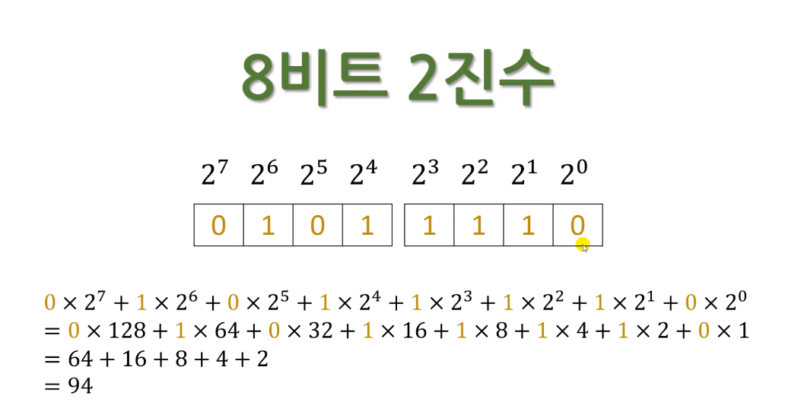
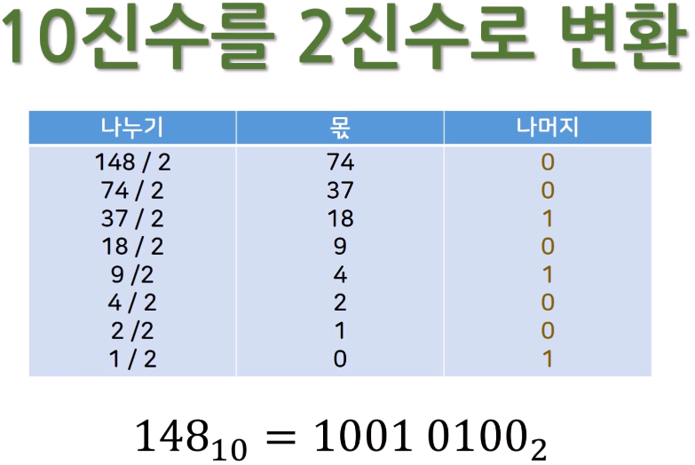
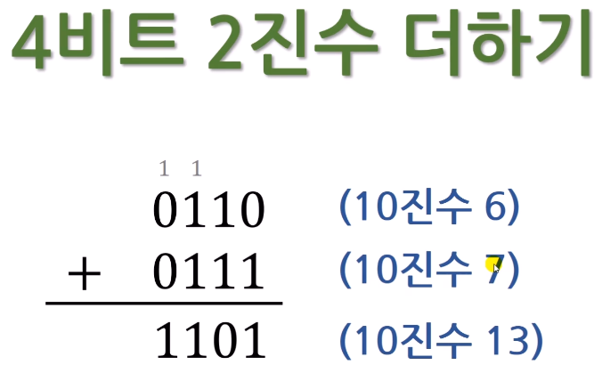
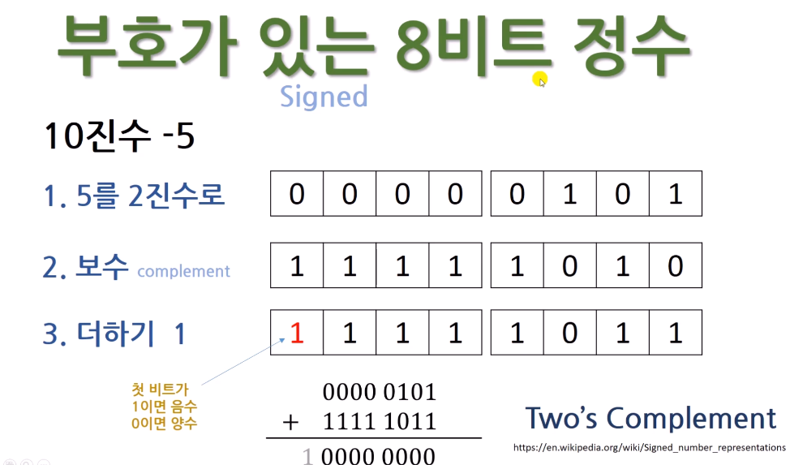
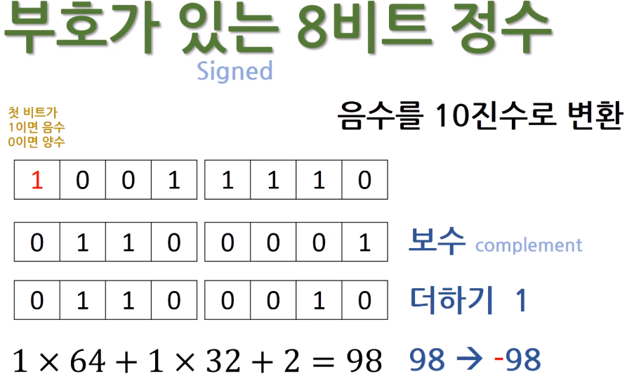
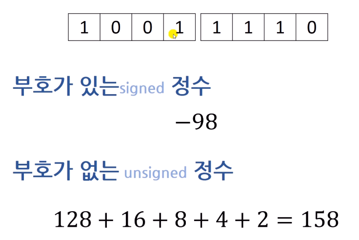
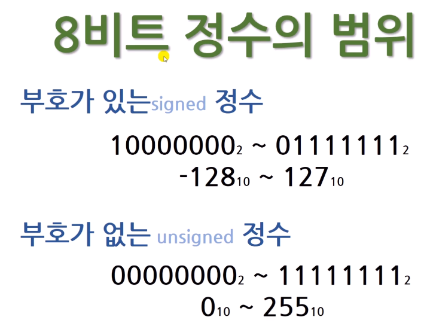

# 0.10 이진수

## 10진수
* 숫자: 0 ~ 9
* 더 큰 수는 자리수를 이용함. 
* ex) 256 = 200 + 50 + 6 = 2 * 100 + 5 * 10 + 6 * 1 = 2 * 10² + 5 * 10¹ + 6 * 1
* cf) 밑(base): 10
* 컴퓨터는 밑을 2로 사용

## 2진수
* 숫자: 0 ~ 1
* 더 큰 수는 자리수를 이용함.
* ex) 2 = 10 = 2¹ * 1 + 2의 0승 * 0

* 10진수를 이용하더라도 내부에선 2진수로 변환하여 사용하고, 출력 때 10진수로 출력되는 것일 뿐.
    - 물론 출력 때도 2진수로 볼 수도 있음.

* 부호가 있는 정수: 음수가 될 수 있다.
    - 부호가 있는 정수 표시 방법은 여럿 있지만, 2의 보수 방법(Two's Complement)을 소개.

- 부호가 있는 정수를 표시할 때, 맨 앞 숫자는 부호를 표시하는 용도로 사용됨.

* `1111 1011 = -5`를 증명하기
    - `1111 1011`과 `5`를 더했을 때 `0`이 되어야 함.
    - 더하면, `1 0000 0000` 이므로, 8비트 기준 `0`이 맞음.
    - `1111 1011`은 `-5`가 맞다.

* 2의 보수 정수 표현법에서 -0과 -0은 같다

* 같은 2진수더라도 부호가 있는 표현법을 가정하거나 부호가 없는 것으로 가정하는 것은 차이가 있다.

* 정수의 범위

