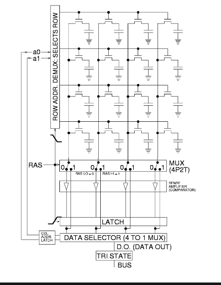
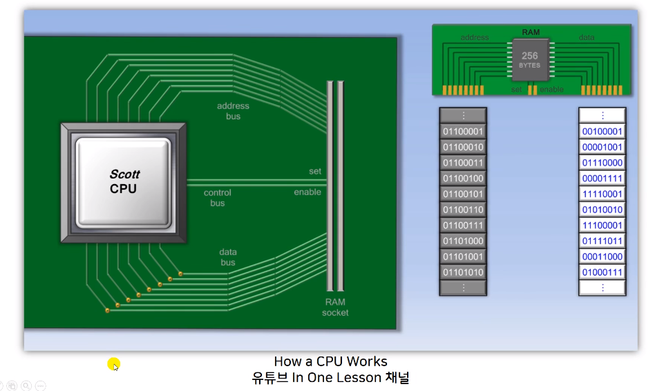

# 0.6 컴퓨터 메모리의 기본 구조

* CPU는 메모리와 같이 일을 해나간다.
    - 연산: CPU, 정보 저장: 메모리

* 메모리에서 CPU로 데이터를 보낼 떄, 캐쉬 메모리를 들른다.
    - 자주 보내는 건 캐쉬 메모리에 두어서 더 빠르게 데이터를 가져올 수 있음.

* 메모리에선 데이터가 1렬로 되어 있다.

### 접근

* 순차 접근 Sequential access
    - 예전에 쓰인 방식. 
    - 칸: 데이터가 담긴 집과 같음.
    - 찾는 사람이 아파트에 사는 것만 알고 몇 호인지 모를 때, 모든 가구를 찾아다녀야 하는 것과 같다.
        - 느림

* 임의 접근 Random access
    - RAM: 임의 접근을 위해 만들어진 장치
    - 아파트 단지가 있을 때, 주소가 있으면 바로 가서 찾아갈 수 있다.
    - 마치 이런 것처럼, 어디든 접근할 수 있다 하여 random access라 한다.

### 메모리의 구조

* 트랜지스터(모자같은 거), 커패시터(?)
    - 트랜지스터 1개, 커패시터 1개가 하나의 셀(cell)
    - 방 하나에 1비트(bit) 씩 저장됨. 이진수 숫자 하나.

* 엄청나게 복잡한 구조. 하나 씩 찾으려면 느리다.

### CPU와 RAM은 어떻게 자료를 주고 받는가?

* 임의 접근이 가능하도록 만들어진 구조
* 주소가 다니는 통로와, 데이터가 다니는 통로가 분리되어 있음.
    - CPU에게 데이터를 보내는 것, 데이터를 받는 것.
* Control BUS: 보낼 건지 받을 건지 결정하는 것. 
* 흐름: CPU가 address bus를 통해 RAM socket에 데이터가 어느 주소에 있다 알려주면, RAM에서 data bus를 통해 CPU로 data를 보낸다
* 어느 주소에 내가 보낼 데이터를 저장하라 하면, RAM은 갖고 있음.

* 포인터는 address bus 때문에 있는 것..ㅋ
