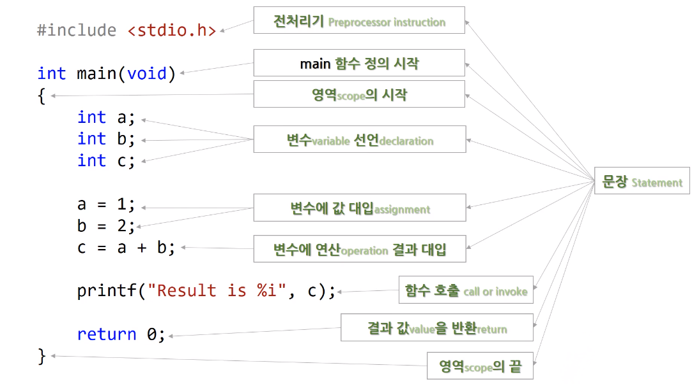

# 2.2 C 프로그램 훑어보기

* 전처리기: 컴파일되기 전에 처리한다는 의미.

* `int main(void)`: main 함수 정의 시작
* `{}`: 영역(scope)의 시작
    - 코드의 덩어리

* 변수
    - `int a`: 선언
    - `a = 1` 값 대입
    - `c = a + b`: 연산 결과 대입

* 함수 호출 (Call or invoke)
    - `printf("Result is %i", c)`

* `return 0`: 결과 값 value을 반한 return
