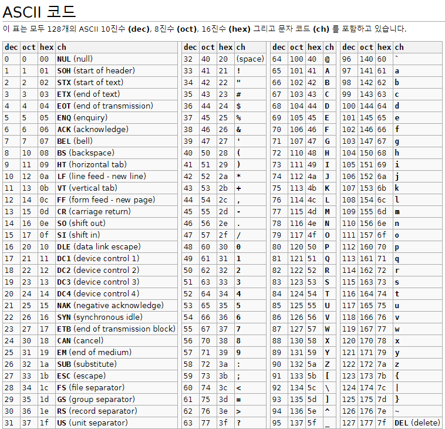
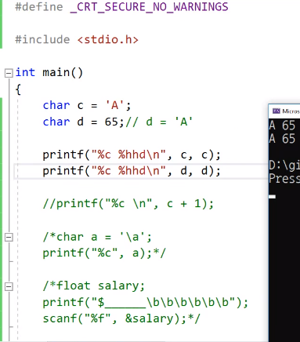

# 3.10 문자형

* 컴퓨터는 내부적으로 문자도 숫자(이진수)로 바꾼다.
* 내부적으로 처리할 때 정수처럼 처리하기 때문에 char 타입도 정수형의 일부인 것처럼 분류하는 것이 일반적이다.

### ASCII Chart
* 어떤 숫자가 어떤 문자와 대응하는지를 보여주는 것이 ASCII Chart

[출처](https://ko.cppreference.com/w/cpp/language/ascii)

* char형 변수엔 문자 하나만 들어감
    - 사용하는 기호: `''`
    - `char c = 'A'; == char d = 65;`
    
* 예시

* ASCII
    - 'A'는 65, +1을 하면 'B'
    - 문자에 `char a = '\a';` escape sequence
    - `\b`(백스페이스)랑 `scanf` 같이 쓸 만함.
        - 입력을 줄 위에 받는 등.
    - `\t`: 탭.