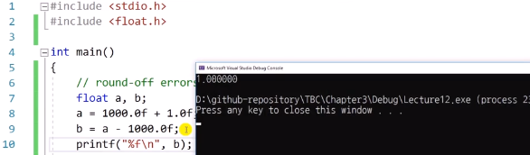
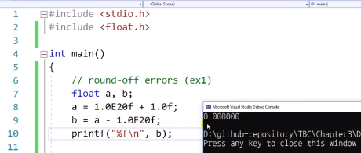
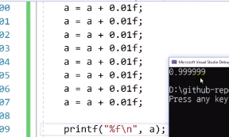
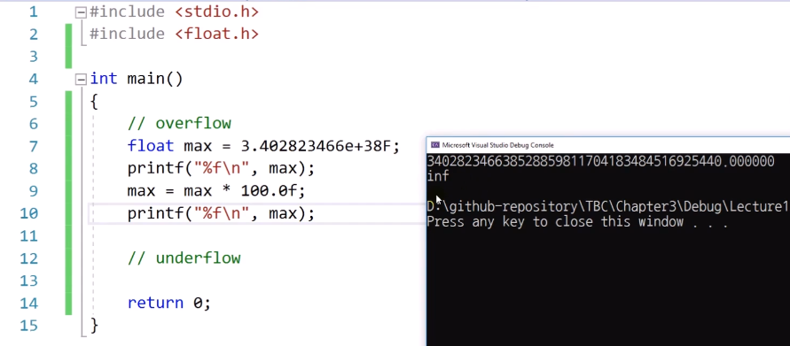
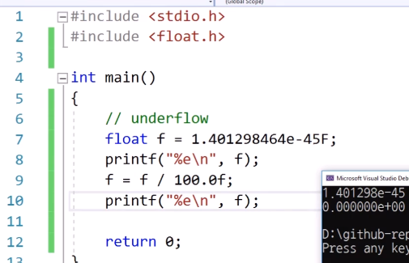
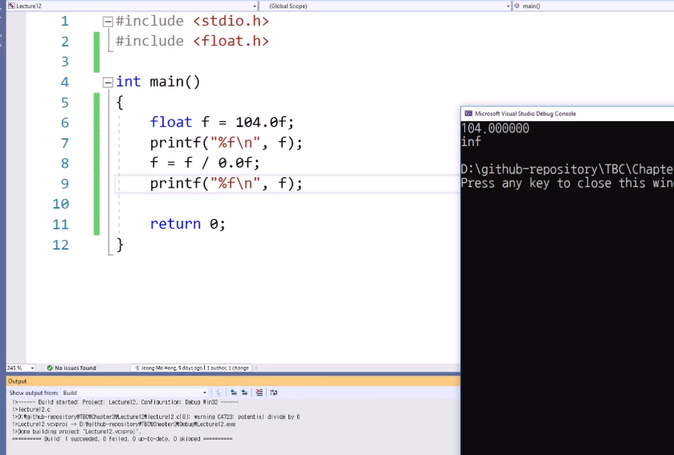

# 3.12 부동소수점형의 한계

### round-off errors (ex1)
#### 정상

#### 오류

* a에서 1.0E20f가 1.0f 보다 상대적으로 너무 크기에 연산이 제대로 되지 않음. 

### round-off errors (ex2)

* 0.01을 100번 더했는데 1이 아님.
    - 0.01f 커서 올리면: 0.00999999976F 등으로 뜨는데, 이 오차가 누적되었기 때문.
    - 분수를 이진수 조합으로 저장하기에, 딱 떨어지지 않아 생길 수 있는 문제.

### overflow

#### float

* 너무 큰 수는 inf로 뜰 수 있다.

### underflow

* 어쩔 수 없이 0으로 나옴.
* 부동 소수점으로 나타낼 수 없는 더 이상의 작은 숫자: subnormal

#### 0으로 나누기

#### 이외
- 수학적으로 존재하지 않는 계산을 하면 NaN이 뜬다.
