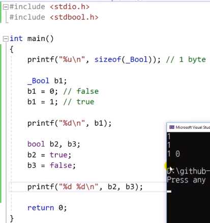

# 3.13 불리언형

## 논리 연산을 할 때 사용
* 고전적 C 문법엔 Boolean형 존재x
* 최근에 `_Bool`이 생김
    - `_Bool`: 최소 단위인 1 byte
    - 나머지 7byte는 비트 연산 등으로 사용 가능.
* false면 0, true면 1

* `<stdbool.h>` 헤더
    - `bool` 사용 가능
    - true는 문자로 쳤지만 결국 1, false는 0
        - true, false: 예약어

* true 판별: false가 아니면 true다.
