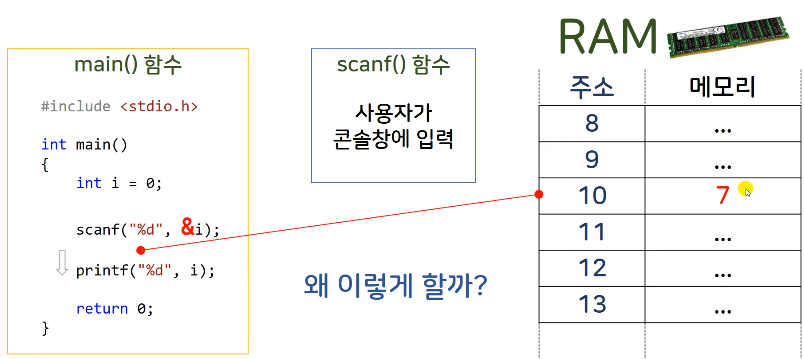

# 3.3 scanf() 함수의 기본적인 사용법

* 콘솔 창으로부터 사용자의 입력을 받아오는 함수

* cf) scanf 함수 에러 (ms vs에서만 나타남)
    - 해결 1: `#define _CRT_SECURE_NO_WARNINGS`를 선언
    - 해결 2: 프로젝트 setting에서 바꾸기
        - 프로젝트 우클릭
        - 속성(property) 
        - C/C++
        - Preprocessor 클릭
        - Preprocessor Definitions에  _CRT_SECURE_NO_WARNINGS 추가. (Debug, Release 모두)

## scanf() 함수 도식

* `&(ampersand)`: 변수의 주소를 가리키는 연산자
    - scanf()에 변수의 주소를 전달하는 역할.
    - scanf() 함수는 스스로 변수 메모리에 직접 접근할 수는 없다. 그러나 값을 바꿔주기 위해 i라는 변수에 접근은 해야 한다.
    - 이에 위와 같은 필요성 때문에, 주소에 값을 입력받아 그것을 덮어씌우는 방식으로 값을 바꾼다.
    - 즉, 주소를 통해 메모리에 직접 접근하는 방식을 취하는 것.
* 왜?
    - C 언어에서 함수는 여러 개의 입력을 받아도 출력이 1개만 가능하다.
    - 여러 개의 값을 바꾸어야 하는 경우도 있는데, 이럴 때 출력 기능으로는 1개의 값만 바꿀 수밖에 없기에, 여러 개의 입력을 받는 기능이 필요해짐.
    - 이에 scanf()에서 주소에 입력된 값은, 해당 공간에 값을 바로 넣어줌으로 주소 메모리의 값이 바뀌게 한다.

