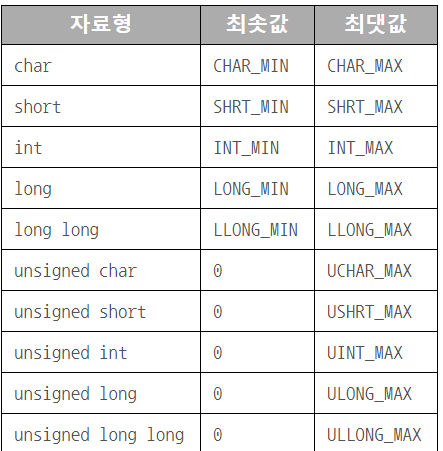
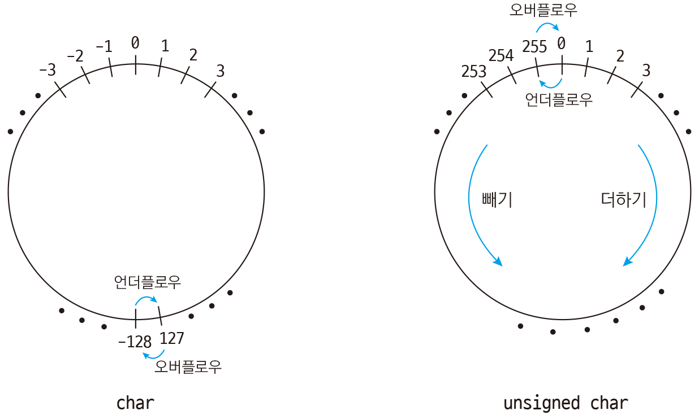

# 3.6 정수의 오버플로우

* 메모리 사이즈를 알아보는 법: `sizeof()`
    - `sizeof(unsigned int);` // `unsigned int` 자료형의 사이즈
    - printf(): 형식 지정자("%d")와 각각의 type specifier 맞춰야 함.
        - ex) `printf("%u", sizeof(unsigned int));`

* 최댓값 알아보기
   - cf) 2진수 입력법 예시(unsigned int 최대값): 0b11111111111111111111111111111111
        - 4바이트 = 32비트 => 꽉 찬 값.
    - `printf("%u", i);` 실행
    - 32비트: 2의 32승 가지 수의 수를 가질 수 있음.
        - 0 ~ 2의 32승 - 1
        - 최대값: 2의 32승 -1

* `<limits.h>` 활용하여 최댓값 알아보기
    - <limits.h> 파일엔 정수 자료형의 최솟값과 최댓값이 정의되어 있음.
    

[이미지 출처: C언어 도장깨기](https://dojang.io/mod/page/view.php?id=34)
    
* signed, unsigned 범위가 다르다. 

* 오버플로우
    - 자료형의 가능한 최댓값보다 더 큰 수를 출력하려면?
        - ex) 1111 + 1 = 10000 / 4비트라면, => 0000
    - 가능한 용량보다 큰(짝은) 값을 요소로 넣었을 때 일어남.

    

[이미지 출처: C언어 도장깨기](https://dojang.io/mod/page/view.php?id=32)
