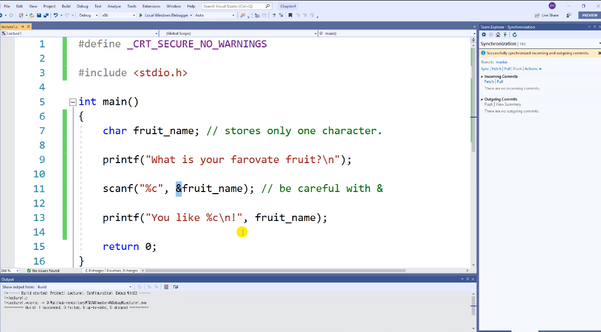

# 4.1 문자열 입출력하기

* 문자열: 여러 개의 문자로 이루어진 것을 말함.

* 출력: 한 글자만 출력됨.
    - char: 입력받은 공간이 글자 하나밖에 담을 수 없기 때문 => 여러 글자를 넣어도 한 글자만 출력됨.

* 해결: 배열 활용 
* 배열: 같은 데아터 타입의 저장 공간을 여러 개 확보하는 것.
    - ex) `char fruitName[40]`: char타입 데이터 40칸을 확보하는 것.
    - 40개의 메모리 공간을 대표하는 주소 1가지만 알려줌.
- 배열로 바꾸고, scanf의 format(conversion specifer)를 c => s
- `&fruitName` => `fruitName`
    - fruitName이 배열이 아닐 땐 &fruitName이 주소지만, 배열일 땐 fruitName 자체가 주소
- printf의 fotmat specifier도 c => s

