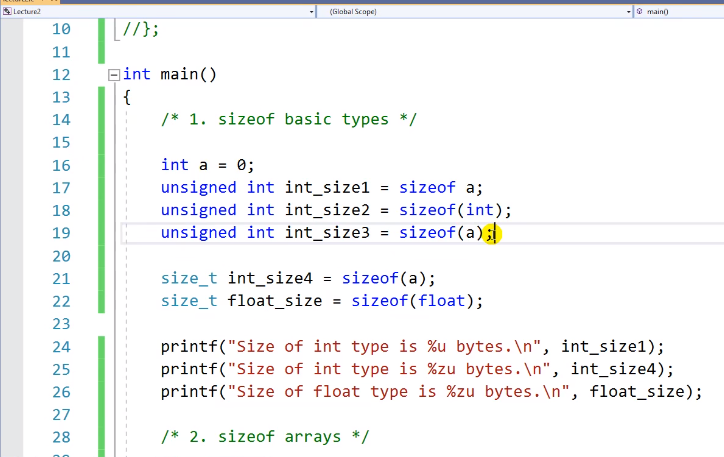

# 4.2 sizeof 연산자

## sizeof 1

* sizeof: 변수의 크기를 알려준다.
    - 크기는 무조건 양수의 개념, 결과적으로 값은 `unsigned int`의 자료형.
    - sizeof는 용법만 놓고 봤을 때 함수와 비슷하나, 괄호 없이 사용도 가능하기에, 연산자라 하는 것이 정확하다.

* `size_t`: typedef unsigned int size_t
    - size_t도 결국 unsigned int와 같음.
        - 혹시나 sizeof가 알려주는 값의 범위가 다른 시스템에서는 unsigned int가 아닐 수는 경우가 있어서 씀.
    - 이식성 ↑
    - `%zu`는 `size_t`에 맞는 형식 지정자

## sizeof 2

* 배열로 초기화하기.
    -  `int arr`의 size는 4 * 30 = 120

* `int int_ptr = NULL`: 주소를 적을 수 있는 종이만 들고 있는 것
* `int_ptr = (int*)malloc(sizeof(int) * 30);`
    - 120바이트 메모리 할당하고, 그 대표하는 주소를 int_ptr에 넣는다.
    - 결과적으로 120바이트를 대표하는 주소의 크기
* sizeof(int_arr)은 120
* sizeof(int_ptr)은 4

* 왜 차이나는가?
    - `int_arr[30]`은 실제 120짜리 공간인데, 사용할 때만 대표주소로서 잠깐 바뀐다.
        - 선언되는 순간 120바이트라 지정됨.
        - compile time, 컴파일 될 때 바로 크기가 저장
    - int_arr을 주소로 생각하자.
    - `int *int_ptr = NULL`
        - 선언될 때 크기가 몇이 될지 모름
        - runtime에 결정됨.
        - 메모지의 사이즈
    
## sizeof 3

* 용법 상 마침표 역할을 하는 문자가 하나 들어간다.
    - 실질적으로 저장되는 공간은 '배열 선언 숫자 - 1'

## sizeof structure

* 구조체의 크기: int(4) + float(4), 각 자료형의 크기