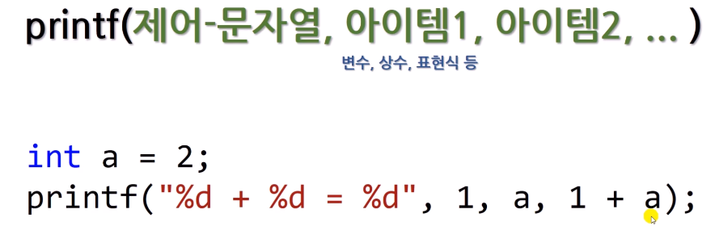
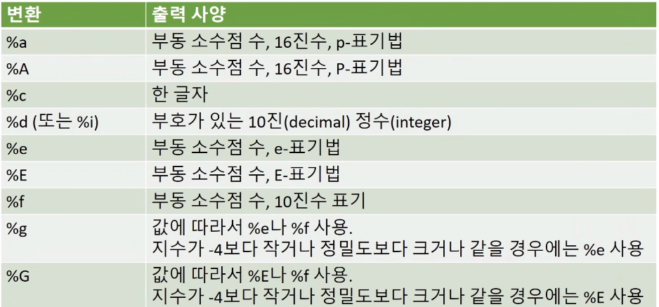
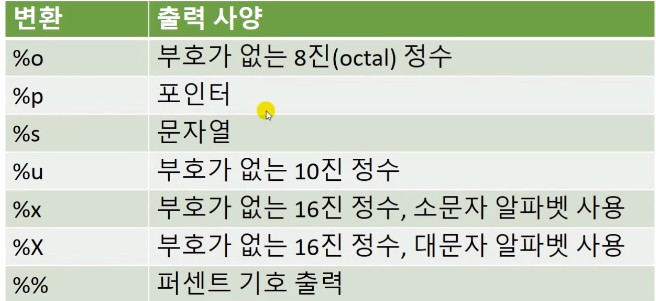
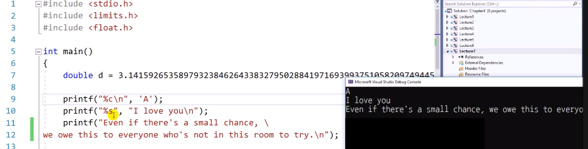
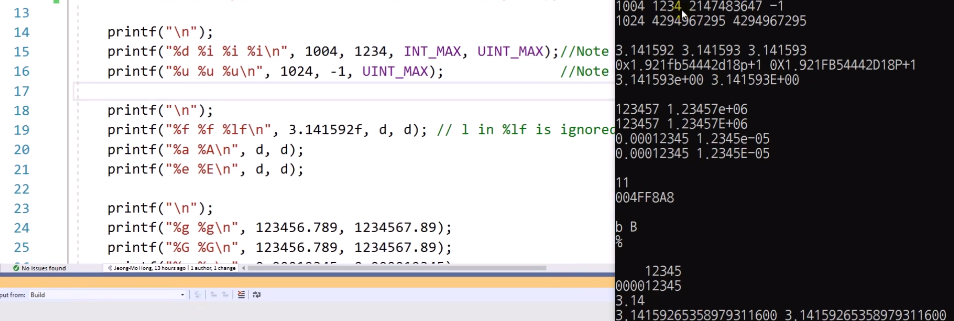
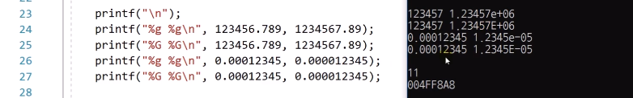
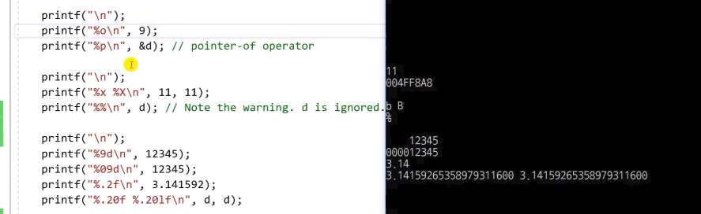
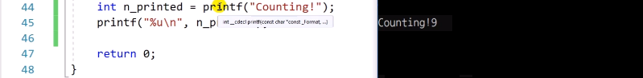

# 4.7 printf()함수의 변환 지정자(Conversion Specifiers)들

### Conversion specifier 기본 형식
* 자료형을 해석해서 어떻게 출력할지 지정해주는 역할
    - cf) 변환 지정자가 형식 지정자로 여겨짐.

### 예제

* 줄바꿈: `\`

### Overflow와 float 출력

* overflow
    - unsigned interger max를 signed integer에 입력 => -1 출력
    - unsigned 출력 자리에 1024 o, 음의 정수 => 오버플로우

* float 출력
    - float 출력 땐 무조건 double 형으로 바꾸기 때문에, `lf` => `l`은 무시됨.
    - printf 땐 `lf` 붙일 필요 없음, but, scanf에선 double을 받을 때 `lf`를 적절히 사용해주어야 함.
    

### %g %G

### 8진수, 16진수, 소수점 자리수, 포인터 표기

* 앞에 숫자: 자리수 맞추기
    - `%9d`면 최소 9자리를 맞추기. 
        - 남은 자리 빈칸 등등
    - `%09d`: 앞에 남은 자리를 0으로 채움
    - `%.2f`: 소수점 이하 2번째 자리까지

### printf 함수의 return value

* `n_printed`: printf함수의 return 값: 출력한 글자 개수(정수)
