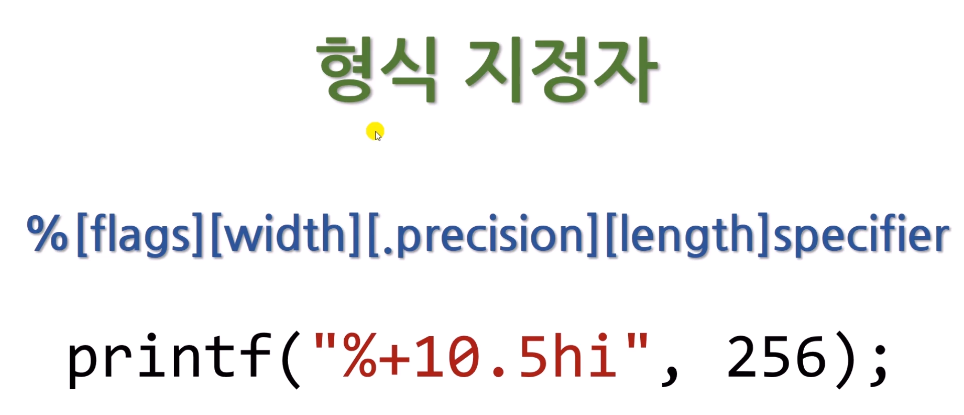
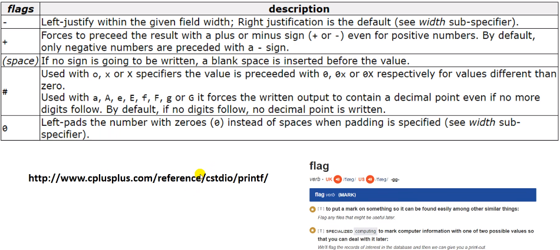
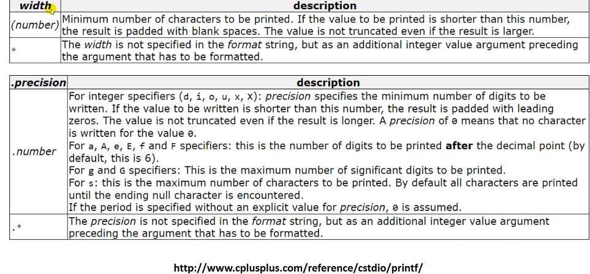
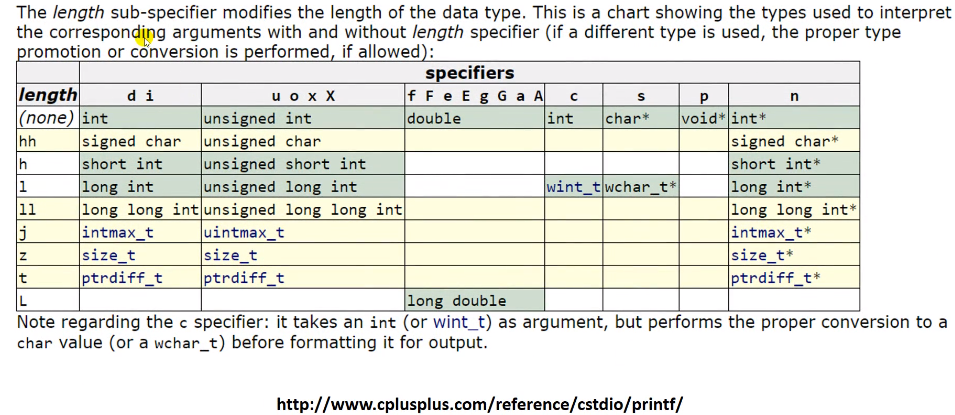
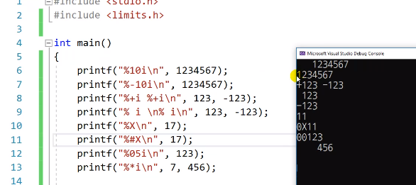
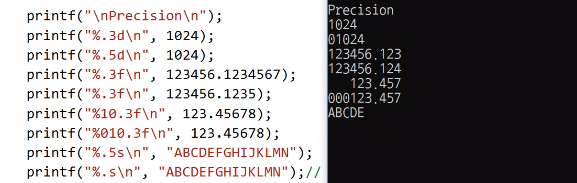
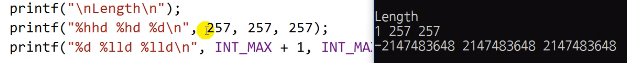

# 4.8 변환 지정자(Conversion Specifiers)의 수식어(Modifiers)들

### 수식어: flags, widths, .precision, length

#### 예시
* `+`: 양수일 때도 `+`기호를 출력해라
* 숫자: 10자리
* 정밀도를 나타내는 숫자: 5개
* h: short
* i: conversion specifier 
    

### flag
* 어떤 방식으로 출력할 거라 표시한다는 뜻.
    - `-`: 왼쪽으로 붙여준다. 없으면 오른쪽 정렬.(default)
    - `+`: 양수일 때도 `+`기호를 출력해라
    - 빈칸: 빈칸을 출력해라
    - `#`: 8, 16진수 등을 출력할 때 앞에 붙는 0, 0x를 출력하는 옵션
    - `0`: 빈 자리가 있을 때 0으로 채운다

#### width 옵션
    - 숫자: 공간 설정
    - `*`: 너비를 따로 지정하도록 해줌

#### precision
    - `.number`: 정밀도 보장 수
    - `.*`: 

#### length
    - data type의 길이, 얼마나 큰 자료형인가
    - cf) n은 거의 사용x 돌아가지 않음

### 예제

* `*`: *에 숫자가 7이 들어감. width를 뒤에 parameter로 삽입

### Precision 

* string과 쓰면 글자수를 제한함.
* `.`하고 숫자를 넣지 않으면 `0`으로 간주되어 출력되지 않음.

### Length

* h: 짧다, hh: char
    - hhd(unsigned char): 256이 최대, overflow
* l: 길다, ll: long long
    - `LL`: 64 자료형

* x86, x64 결과가 다름.