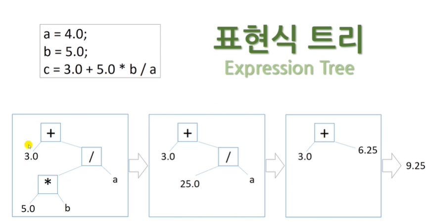
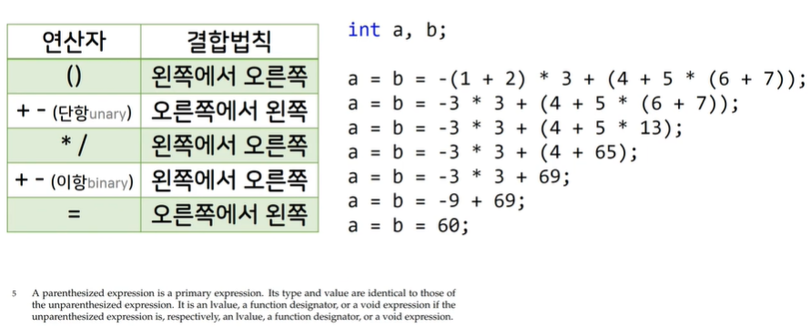

# 5.6 연산자 우선순위와 표현식 트리(expression tree)

## 표현식 트리

* 우선순위.
    -  컴퓨터 내부: 컴파일러가 수식을 보고, 그래프 구조를 만들어 우선순위을 파악하고 계산한다.

## 연산자 우선순위

* 대입연산자: __오른쪽 => 왼쪽__ 방향으로 대입이 이루어짐.
* __( )__ 괄호로 묶인 expression은 __primary expression__. 
    - __()__ : 연산자. 마치 함수에서의 __()__ , 형변환 __()__ 과 유사함.
