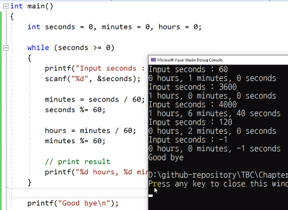
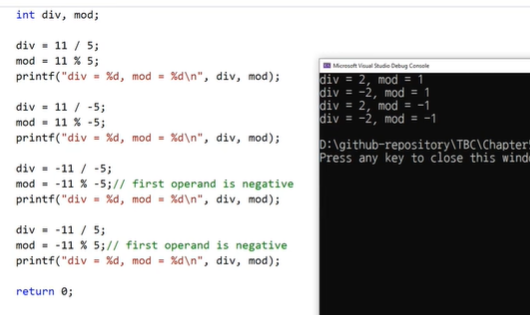

# 5.7 나머지 연산자
* `int a = 13 % 5; // 3`  
* `int b =  90 % 60; // 30`

### 음수 나누기?

* 몫은 원래 수학대로.
* 나머지는 앞 피연산자의 부호를 따라간다. 
    - 두 번째 식을 생각해보자. 
    - 11을 -5로 나누면, 몫은 -2
    - 그리고 -5 * (-2)의 결과가 10이니, 나머지는 1이어야 한다. 
    - 그냥 어렵게 생각할 것은 아니고, 나머지가 나오는 방법 역시 상식적으로 맞다고 생각되는 원리로 보인다.