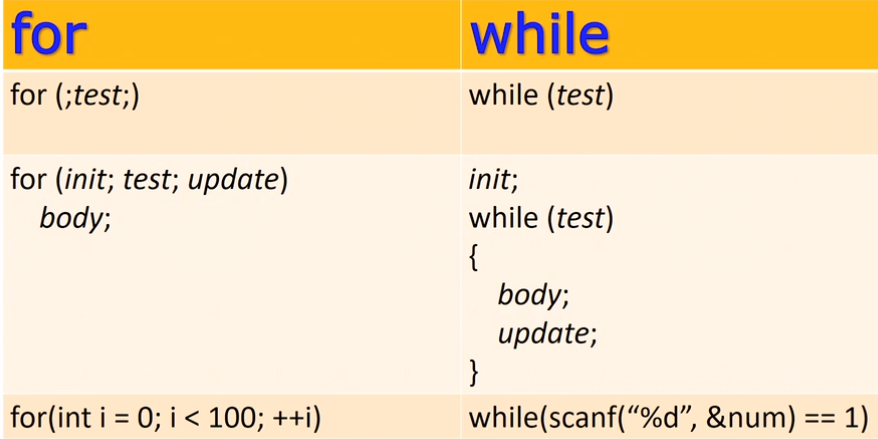

# 6.14 어떤 루프를 사용할까
## 어떤 루프를 어떤 상황에 사용해야 적절한가?

## 구현 1: 진입조건 vs 탈출조건
* 처음 1번 무조건 써야 한다면, do while
* 일반적으론 while, for
* 진입조건 while, for __VS__ 탈출조건 do while

## for와 while

* 대부분 for을 많이 사용하게 됨.
    - 메모리를 할당 받아두고, 순서대로 데이터 삽입하는 일이 대부분이기 때문.
        - 배열 설명 때 더 자세히 다룰 예정
    -  for문은 첫 줄을 보면 무엇을 하려는지 파악하기 쉽다는 장점도 있음.

* 사용 사례
    - for: 메모리 구조에 맞춰서 데이터를 작업할 때. 숫자를 세면서 작업할 때
    - while: 보통 정의가 명확하게 되어 있지 않은 상태에서 사용.
        - 예시) 게임 유저가 게임 종료 버튼을 누르지 않는다면 계속 play하게 함.