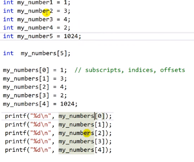

# 6.16 배열 Array과 런타임 Runtime 에러

* 같은 데이터 형을 여러 개 사용할 때, 메모리 덩어리를 한 번에 가져오기 위해 사용.

## Array 기본 예시

* 일반적인 선언과 비교.
    - 배열의 편리성은 값을 할당하는 방식 등에서 살펴볼 수 있음.
    - 첨자를 통해 값에 접근

* `[i]`
    - `i`는 offset
        - 메모리가 쭉 할당되어 있는데, 얼마나 떨어져 있는가.

* `array[0]`은 array의 첫 번째 주소에 대응한다.
    - `scanf("%d", &my_numbers[0]) == scanf("%d", my_numbers);`

## Runtime Error

* 선언하지 않은 공간에 값을 선언.
    - 예시)   
    
            int array[5];
            array[5] = 5; // out of bound
    - compile할 땐 체크되지 않음.
    - debugging하면 찾아주기도 함.
    - 할당받은 범위를 넘어가는 주소에 값 할당.

## Compile error
            array[5];
            array = 5;
- `array`는 주소이기 때문에 대입 연산이 되지 않음.