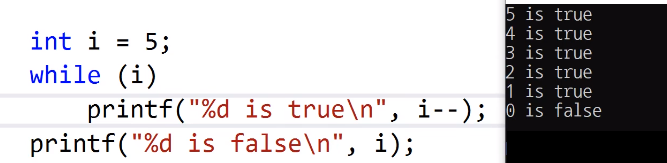

# 6.5 사실과 거짓

## 복습
* 표현식은 값을 갖는다.

## 예제 1

            int tv, fv;
            tv = (1 < 2); // (1 < 2)는 표현식이기에, 하나의 값을 갖는다.
            fv = (1 > 2); // (1 > 2)는 표현식이기에, 하나의 값을 갖는다.

            printf("True is %d\n", tv); // 1
            printf("False is %d\n", tv); // 0

* 진실, 거짓이 어떤 값을 갖는지 확인

## 예제 2

* `while (i)`: () 안에 i 하나만 있지만 표현식임.
* __0은 false고 다른 것은 모두 true다.__
    - 이를 이용한 trick 많이 쓰는 편

