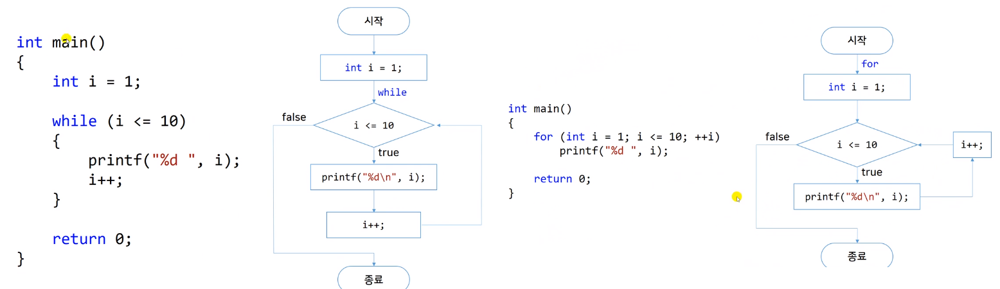

# 6.9 for는 유연해요
## for문의 유연성
* 구조  

            for (initialize; test; update)
                statement

## 예시들

*
            for (int i = 10; i > 0; i--)
                printf("%d ", i);
*
            for (int i = 0; i < 100; i = i + 8)
                printf("%d ", i);
*
            for (char c = 'A'; c <= 'Z'; c++)
                printf("%c ", c);
*
            for (int i = 0; i * i < 10; i++)
                printf("%d ", i);
            // 조건에 함수도 넣을 수 있음.
*
            for (int x = 1, y = 5; y <= 20; y = (++x * 3) + 10)
                printf("%d ", x);
            // update 코드를 조금 복잡하게, 초기화를 한 번에 2개. (서로 같은 자료형만 가능)
*
            for (double d = 100.0; d < 300; d = d * 1.1)
                printf("%f\n", d);
            // 실수형도 사용 가능
*
            int i, n;
            n = 2;

            for (i = 2; n < 10; )
            {
                n = n * i;
                printf("%d\n", n);
            }
*
            for (;;)
                printf("I love you! ");
            while(1)과 동일
*
            int i = 0;
            for (printf("let's go!\n"); i != 7; scanf("%d", &i))
            // 처음할 때 printf를 하고, 입력 숫자가 7이 아니면 계속 돌게 하는.
            // 사용할 수야 있지만, 너무 복잡스러움. 코딩에서 기교부리지 말고, 알고리즘에서 경쟁력을 갖기.