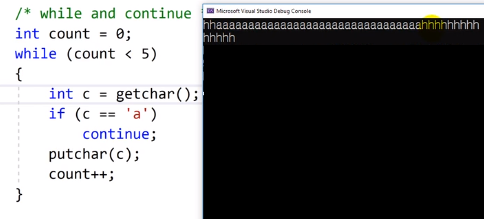
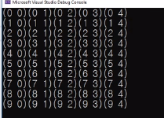

# 7.10 루프 도우미 continue와 break

# 예제 1: continue

            int main()

            for (int i = 0; i < 10; ++i)
            {
                if (i == 5)
                    continue;

                printf("%d ", i);
            }

- continue를 만나면 이후 부분이 실행되지 않고 바로 반복문으로 다시 돌아간다.

  - `i == 5`일 땐 `prinf()`가 실행되지 않음.

            int main()

            for (int i = 0; i < 10; ++i)
            {
                if (i != 5)
                    printf("%d ", i);
            }

위 코드와 같은 결과.

- 실무에 들어가서 사용할 일이 더 많아지긴 함.

# 예제 2: break

            int main()

            for (int i = 0; i < 10; ++i)
            {
                if (i == 5)
                    break;

                printf("%d ", i);
            }

- break: continue는 루프 처음으로, break는 자신이 포함된 첫 번째 루프에서 탈출.
  - 2중, 3중 루프에선 조금 실수의 여지.

# 예제 3: while and continue

            int count = 0;
            while (count < 5)
            {
                int c = getchar();
                if (c == 'a')
                    continue;
                putchar(c);
                count++;
            }

- 중간에 무시하고 싶은 조건을 continue로 무시하기.

# 예제 4: for and continue

            for (int count = 5; count < 10; ++count)
            {
                int c = getchar();
                if (c == 'a')
                    continue;
                putchar(c);
            }

# 예제 5: continue as a placeholder

            while (getchar() != '\n')
                continue; // ...

- placeholder: 하는 것은 없지만 자리는 차지하고 있고 이곳에서 무엇을 할 수 있다는 의미.
  - 체크용

# 예제 6: Need to use continue?

            char c;
            while ((c = getchar()) != '\n')
            {
                if (c == 'a')
                    continue;
                putchar(c);

                // if (c != 'a')
                //   putchar(c);

            }

- 2가지 관점
  - 둘의 기능은 같음. 간결하게 작성하는 것은 후자.
  - 걸러내는 의미로 코드 구현을 한 것이다. (전자 관점)

# 예제 7: break 예제

            char c;
            while ((c = getchar()) != '.' )
            {
                putchar(c)
            }

- break로 바꾸면,

            while (1)
            {
                char c = getchar();

                if (c == '.')
                    break;

                putchar(c);
            }

- while 조건에 여러 기능을 주면 헷갈릴 확률 높음.
  - 한 식엔 한 기능. 직관적이고 이해하기 쉬운.
  - break 방식을 더 많이 씀.

# 예제 8: break를 다중 루프 안에서 활용

            for (int i = 0; i < 10; i ++)
            {
                for (int j = 0; j < 10; j++)
                {
                    if (j == 5)
                        break;

                    printf("(%d %d)", i, j);
                }

                printf("\n");
            }

- loop 한 개만 깨고 나온다.
