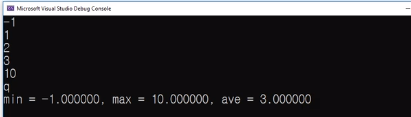

# 7.11 최대, 최소, 평균 구하기 예제

## prof 제시문

            #define _CRT_SECURE_NO_WARNINGS
            #include <stdio.h>
            #include <float.h>

            int main()
            {
                float max = -FLT_MAX;
                float min = FLT_MAX;
                float sum = 0.0f;
                float input;
                int n = 0;

                while (scanf("%f", &input) == 1)
                {
                    max =
                    min =
                    sum += input;

                    // TODO: ignore negative values;

                    n++; // Count number of inputs
                }

                if (n > 0)
                    printf("min = %f, max = %f, ave = %f\n", min, max, sum / n);
                else
                    printf("No Input\n");

                return 0;
            }

## 1차 완성

            max = (input > max) ? input : max; // max, min 처음엔 무엇을 넣어도 input보다 클 것이다
            min = (input < min) ? input : min; //

## 2차 조건

- `TODO: ignore negative values;`
  - 0보다 작을 경우, 100보다 클 경우 무시.

            if (input > 100.0f || input < 0.0f)
                continue;
