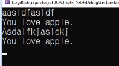

# 7.12 다중 선택 switch와 case

## 예제

            #define _CRT_SECURE_NO_WARNINGS
            #include <stdio.h>

            int main()
            {
                char c;
                while ((c = getchar()) != '.')
                {
                    printf("You love ");

                    switch (c) // Note: integer types only.
                    {
                    case 'a':
                    case 'A': // 소문자와 대문자에 대해 모두 같은 결과. (case 여러 개 => 1개 결과 가능)
                        printf("apple");
                        break;
                    case 'b':
                    case 'B':
                        printf("baseball");
                        break;
                    case 'c':
                    case 'C':
                        printf("cake");
                        break;
                    default:
                        printf("nothing");
                    }

                    printf(".\n");

                    while (getchar() != '\n')
                        continue;
                }

                return 0;
            }

- 체크 포인트
  - `while((c = getchar()) != '.')`: 마침표 입력을 받으면 종료케 함.
  - `while (getchar() != '\n')`: 줄바꿈이 인식되면 끝내는 것이 아니라 `continue`로 다시 while문 루프 돌도록 구현.

