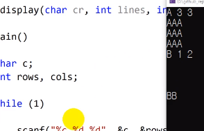

# 8.5 숫자와 문자를 섞어서 입력받기

## 예제

            #define _CRT_SECURE_NO_WARNINGS
            #include <stdio.h>

            void display(char cr, int lines, int width);

            int main()
            {
                char c;
                int rows, cols;

                while (1)
                {
                    scanf("%c %d %d", &c, &rows, &cols);
                    display(c, rows, cols);
                    if (c == '\n')
                        break;
                }

                return 0;
            }

            void display(char cr, int lines, int width) {
                for (int i = 0; i < lines; ++i)
                {
                    for (int j = 0; j < width; ++j)
                        putchar(cr);
                    putchar("\n");
                }
            }

- 첫 번째에 enter가 입력되면 바로 종료를 시키고 싶음.
  - but, scanf()를 사용하면 깔끔하게 종료되지 않음.

### 해결

            scanf("%c %d %d", &c, &rows, &cols);
            while(getchar() != '\n') continue; // 추가된 부분
            display(c, rows, cols);

- 위 코드는 줄바꿈이 일어날 때 끝내준다는 효과가 있으나 부족함.

### 최종

            #define _CRT_SECURE_NO_WARNINGS
            #include <stdio.h>

            void display(char cr, int lines, int width);

            int main()
            {
                char c;
                int rows, cols;

                printf("Input one character and two integers: \n");
                while ((c = getchar()) != '\n')
                {
                    scanf("%d %d", &rows, &cols);
                    while (getchar() != '\n') continue;

                    display(c, rows, cols);
                    printf("Input another character and two integers: \n");
                    printf("Press Enter to quit.\n");
                }
                return 0;
            }

            void display(char cr, int lines, int width)
            {
                int row, col;

                for (row = 0; row < lines; row++)
                {
                    for (col = 0; col < width; col++)
                        putchar(cr);
                    putchar('\n');
                }
            }

- 원리: 문자와 숫자를 따로따로 받는다.
  - 이를 위해 `getchar()`와 `scanf()` 섞어 사용.
  - 여러 번 연산하더라도, 처음에 `enter` 하나만 받아 비교함.
    - 거기서 `enter` => newline: 종료, `enter`가 아닐 경우 => 이후 코드 진행
  - 또한 진행 중 버퍼를 비우지 않아 생길 수 있는 오류를 방지하기 위해 `getchar() != '\n'`로 버퍼를 깔끔하게 비움.
