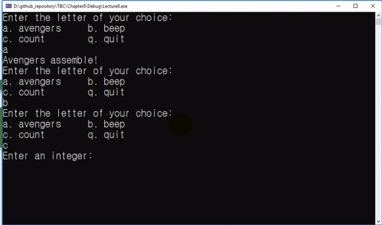
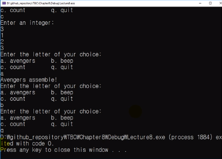

# 메뉴 만들기 예제

## 예시

## mine

            #define _CRT_SECURE_NO_WARNINGS
            #include <stdio.h>

            void printNum(int number);

            int main()
            {
                int choice = 0;
                int inputNum = 0;

                while (1) {
                    printf("Enter the letter of your choice: \n");
                    printf("a. avengers \t b. beep \n");
                    printf("c. count \t\ q. quit\n");

                    (choice = getchar()) != 0;
                    if (choice == 'a'){
                        printf("avengers assemble!\n");
                        getchar();
                    }
                    else if (choice == 'b') {
                        printf("\a");
                        getchar();
                    }
                    else if (choice == 'c') {
                        printf("Enter an integer: \n");
                        scanf("%d", &inputNum);
                        printNum(inputNum);
                        getchar();
                    }
                    else if (choice == 'q')
                        return;
                    else {
                        printf("Wrong input! Try again.\n");
                        getchar();
                    }
                }
                return 0;
            }

            void printNum(int number) {
                for (int i = 1; i <= number; i++) {
                    printf("%d\n", i);
                }
            }

## prof example 1

            #define _CRT_SECURE_NO_WARNINGS
            #include <stdio.h>
            #include <stdlib.h>

            char get_choice(void);
            char get_first_char(void);
            int get_integer(void);
            void count(void);

            int main()
            {
                int user_choice;

                while ((user_choice = get_choice()) != 'q')
                {
                    switch (user_choice)
                    {
                    case 'a':
                        printf("Avengers assemble!\n");
                        break;
                    case 'b':
                        putchar('\a');
                        break;
                    case 'c':
                        count();
                        break;
                    default :
                        printf("Error with %d. \n", user_choice);
                        exit(1);
                        break;
                    }
                }
                return 0;
            }

            void count(void)
            {
                int n, i;

                printf("Enter an integer:\n");
                n = get_integer();
                for (i = 1; i <= n; ++i)
                    printf("%d\n", i);
                while (getchar() != '\n')
                    continue;
            }

            char get_choice(void)
            {
                int user_input;

                printf("Enter the letter of your choice:\n");
                printf("a. avengers\tb. beep\n");
                printf("c. count\tq. quit\n");

                user_input = get_first_char();

                while ((user_input < 'a' || user_input > 'c') && user_input != 'q')
                {
                    printf("Please try again.\n");
                    user_input = get_first_char();
                }

                return user_input;
            }

            char get_first_char(void)
            {
                int ch;

                ch = getchar();
                while (getchar() != '\n')
                    continue;

                return ch;
            }

            int get_integer(void)
            {
                int input;
                char c;

                while (scanf("%d", &input) != 1)
                {
                    while ((c = getchar()) != '\n')
                        putchar(c);
                    printf(" is not an integer. \nPlease try again.");
                }

                return input;
            }
