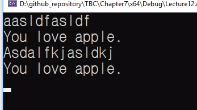

# 8.9 텍스트 파일 읽기

- text 파일을 읽어들일 때 EOF는 어떻게 작용하는가?

## 예시

            #define _CRT_SECURE_NO_WARNINGS
            #include <stdio.h>
            #include <stdlib.h> // exit()

            int main()
            {
                int c;
                FILE* file = NULL;
                char file_name[] = "my_file.txt";

                file = fopen(file_name, "r");
                if (file == NULL)
                {
                    printf("Failed to open file. \n");
                    exit(1);
                }

                while ((c = getc(file)) != EOF)
                    putchar(c);
                fclose(file);

                return 0;
            }

- `FILE* file = NULL`: file이라는 pointer 변수에, 파일을 읽어들이는 stream을 다룰 수 있는 어떠한 정보가 담겨 있다.

- `fopen` 함수: 파일로부터 데이터를 읽어오거나 입력할 수 있는 통로를 열어줌.

  - `file = fopen(file_name, "r");` 함수가 반환하는 값이 file에 저장됨.
  - `r`: read, 데이터를 읽으려고 할 때 사용.
    - 기본: text 파일. // binary 등 있음.
  - `w`: write, 데이터를 입력하려고 할 때 사용.

- `fclose`: 열었으니 닫는다.

- `exit(i)`: 프로그램 종료: i 숫자 기입 => exited with code i

### 실행 시 오류

- visual studio로 실행할 땐, `.vcxproj` 파일과 같이 있어야 실행됨.
- 보통의 경우(cmd 등으로 실행): 실행파일이 있는 디렉토리에 같이 있어야 실행됨.
