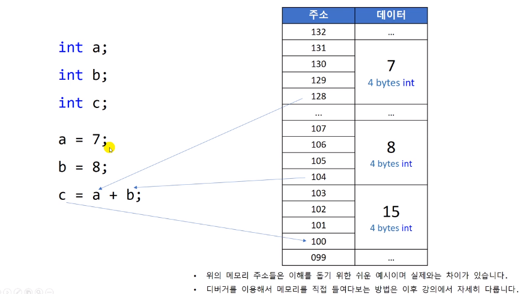

# 9.12 포인터의 작동 원리

## 변수 사용

- 변수 선언: 변수 이름을 통해 메모리 공간을 사용하겠다는 의미
  - Q. 어디에 있는 메모리를 사용할 것인가? A. 첫 번째 주소를 내부적으로 변수가 알고 있음.
  - Q. 얼마나 많은 메모리를 사용하는가? A. 자료형으로 알 수 있음.
    - ex) `int` 타입: 처음 주소부터 4바이트 공간 사용

- `a = 7;`: 128부터 시작되는 4바이트 메모리 공간에 7이라는 데이터를 저장한다.
- `b = 8;`: 위와 같음
- `c = a + b;`: 내부적으로 알고 있는 `a`의 주소에 접근, 4바이트만큼의 데이터를 갖고 온다. cpu가 갖고 있는 임시 저장소에 `7`이 저장됨. `b` 역시 마찬가지.
  - 가져온 후엔 `+` 연산 수행 (CPU)
  - 계산 결과인 `15`라는 값을 CPU 임시 저장소에 저장.
  - 대입 연산자 수행을 위해 변수 `c`가 사용하는 메모리 공간을 가져옴.
  - 4바이트 공간에 `15`를 저장.

## 변수의 주소를 직접 사용하고 싶다면?

- 변수 앞에 단항 연산자 `&`를 붙이면, 변수의 주소의 숫자값을 가져온다.

* 포인터 변수: **주소 값을 저장하는 변수** - 변수 이름 앞에 `*`

  - ex) `int *a_ptr = &a;`
    - `int`형 변수의 주소를 저장할 수 있다.
  - `a_ptr`도 변수
    - 메모리에 공간을 갖고 있다.
    - 공간에 주소 값을 저장하는 것.
  - 아주 많은 양의 데이터가 저장되어 있는 장소의 주소를 알 필요가 있음.
  - 직접 데이터를 저장하는 것이 아님.

## 주소 공간에서 데이터를 가져오려면?

- indirection 간접 접근 연산자: `*`
  - 역참조 dereferencing 혹은 방향 재지정 redirection 등으로 표현되기도 함.
  - 주소를 보고 메모리에 찾아감.
  - `*a_ptr = 8;` => 주소 공간에 8을 넣는다.
  - 기능 상으로는 `int a = 8`과 유사

## 연산 예시

- 주소 값을 보고 공간에 찾아가서 내부의 값을 변경.
