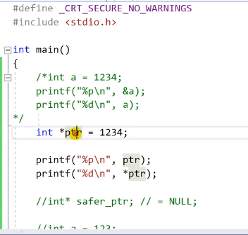

# 9.15 NULL 포인터와 런타임 에러

## 예제

- 일반적인 변수 선언 (ex: `int a = 1234`)처럼, 포인터 변수도 선언 시 메모리 공간을 갖는다.
- 일반적인 변수 선언 시 초기화를 해주지 않으면 메모리 안엔 쓰레기값이 들어있다.
- 포인터 변수 메모리 안엔 어떠한 주소 값이 들어있어야 한다. (초기화)
  - 그러나 포인터에 할당하는 값이 주소값이 아니라면 (초기화되지 않은 값) 제대로 작동하지 않음.
  - 어떤 메모리의 주소를 가리켜야 하는데, 가리킬 메모리가 없음!
  - **redirection 과정에서, program이 `1234`라는 주소로 가려고 하니까 그때 문제가 생김.** 어떤 집을 간지 알 수도 없음. (`int *ptr = 1234`)

* **런타임 에러** 는 주소를 잘못 입력해두었을 때 생김.

## 방지하는 방법: NULL 포인터 사용하기

- 어떠한 조건에 따라 포인터가 실제 존재하는 메모리를 가리킬지 아닐지 결정되는 경우가 있음. (런타임에 결정되는 경우가 많음.)

            int* safer_ptr;

            int a = 123;

            int b;
            scanf("%d", &b);

            if (b % 2 == 0)
                safer_ptr = &a;

- b의 값에 따라 포인터에 `a`의 주소를 넣을지 말지 결정함.
  - 포인터는 초기화가 될 수도, 안 될 수도 있음.
- 따라서 대부분의 C 프로그래머들은 포인터 선언 시 `NULL` 값을 대입해줌. (NULL로 초기화 함.)
  - `int* safer_ptr = NULL;`
