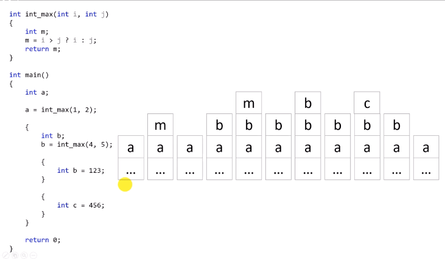

# 9.5 지역 변수와 스택
## 컴퓨터 내부에서 일어나는 일

## 순차적으로 살펴보기

* 프로그램이 실행되면, 실행에 필요한 최소한의 메모리를 사용하기 시작함.
  - `...`인 이유: 컴파일러와 OS는 알지만, 프로그래머인 우리는 알기 어렵고 알 필요 없는 메모리를 표현한 것.
* main 함수 실행
  - main함수를 실행하기 위해 필요한 변수 `a`를 만남.
    - `int a;` 
  - `a = int_max(1, 2)`
    - a가 메모리 배정을 받으며 stack에 쌓임.
    - `int max()`를 만나 `int m`을 접하면, m에 해당하는 메모리가 할당됨.
    - 함수가 끝나면 반환값을 a에 할당해주며, 지역변수 m은 스택 메모리에서 사라짐.
  - 두 번째 스코프
    - `int b`: 스택에 쌓임.
      - `a`, `b`를 동시에 사용가능한 상태.
    - `b = int_max(4, 5)`: `a = int_max(1, 2)`와 같은 방식으로 작동
  - 세 번째 스코프
    - `int b = 123;`
    - 이 스코프 내에선 `b`의 값이 `123`.
    - 이름은 같지만 서로 다른 메모리.
    - 가장 나중에 쌓인 `b`(같은 영역에 선언된)를 쓰는 것일 뿐.
    - 프로그래밍의 간결성을 위해 의도적으로 이름을 겹쳐서 쓰는 경우도 많음.
    - 스코프 탈출: `b` 사라짐
  - 네 번째 스코프
    - 세 번째 스코프와 같은 움직임
  - 두 번째 스코프 종료
  - return 0 실행
  - 실행을 완료하며 스택 메모리도 비워짐.