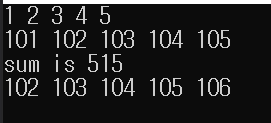
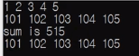

# 10.11 배열 매개변수와 const

- 함수 매개변수로 배열을 넣을 때

## 예제

            #define _CRT_SECURE_NO_WARNINGS
            #include <stdio.h>

            void print_array(int arr[], int n)
            {
                for (int i = 0; i < n; i++)
                    printf("%d ", arr[i]);
                printf("\n");
            }

            void add_value(int arr[], int n, int val)
            {
                int i;
                for (i = 0; i < n; i++)
                    arr[i] += val;
            }

            int sum(int arr[], int n)
            {
                int i;
                int total = 0;

                for (i = 0; i < n; i++)
                    total += arr[i] ++; // arr[i]의 값이 변하도록 일부러.

                return total;
            }

            int main(void)
            {
                int arr[] = { 1,2,3,4,5 };
                int n = sizeof(arr) / sizeof(arr[0]);

                print_array(arr, 5);
                add_value(arr, 5, 100);
                print_array(arr, 5);

                int s = sum(arr, n);

                return 0;
            }

### 실행 결과

- 원래 의도는 배열 내 원소들의 합만 구하는 것인데, `add_value` 전후로 배열 내 각 원소들의 값도 1씩 오름.

#### int_sum

            int sum(const int arr[], const int n)
            {
                int i;
                int total = 0;

                for (i = 0; i < n; i++)
                    total += arr[i]; // 수정.

                return total;
            }

- `int arr[]` => `const int arr[]`: 배열 내 값이 변할 필요는 없기 때문에.
  - `arr[i] ++`이 에러로 발생(컴파일 에러)
  - `arr[i]`로 변경
- `int n` => `const int n`: 역시 마찬가지.

#### print_array

- `print_array`함수 또한, print만 하는 것이지 array의 값을 바꾸는 것은 아님.
- 변경 전

            void print_array(int arr[], int n)
            {
                for (int i = 0; i < n; i++)
                    printf("%d ", arr[i]);
                printf("\n");
            }

- 변경 후

            void print_array(const int arr[], const int n)
            {
                for (int i = 0; i < n; i++)
                    printf("%d ", arr[i]);
                printf("\n");
            }

#### add_value

- 변경 전

            void add_value(int arr[], int n, int val)
            {
                int i;
                for (i = 0; i < n; i++)
                    arr[i] += val;
            }

* `arr`내 원소 값이 변함 => const로 바꾸면 안 됨.
* `n`과 `val`은 하는 것이 좋음.

- 변경 후

            void add_value(int arr[], const int n, const int val)
            {
                int i;
                for (i = 0; i < n; i++)
                    arr[i] += val;
            }

#### main 함수

            int main(void)
            {
                int arr[] = { 1,2,3,4,5 }; ①
                const int n = sizeof(arr) / sizeof(arr[0]); ②

                print_array(arr, 5);
                add_value(arr, 5, 100);
                print_array(arr, 5);

                int s = sum(arr, n);

                return 0;
            }

- ①에 `const int arr[]` => `add_value`에서 오류
  - 배열의 값을 바꾸려고 하는 것인데 `const`를 하면 오류.
- ②은 상관없음.
