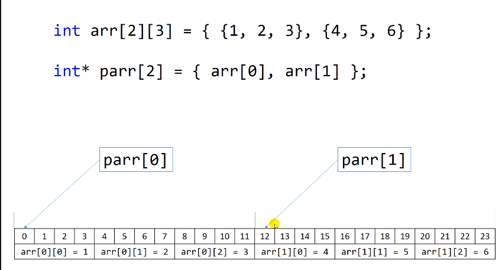
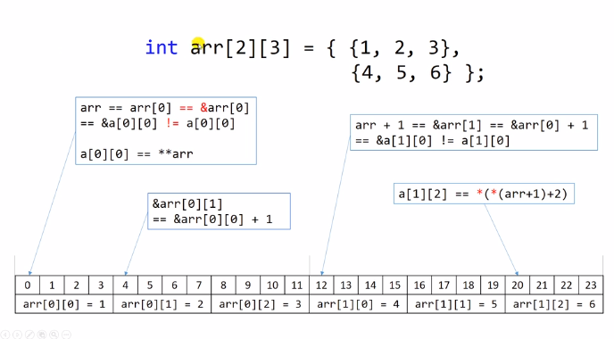
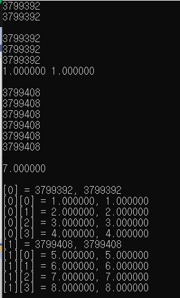
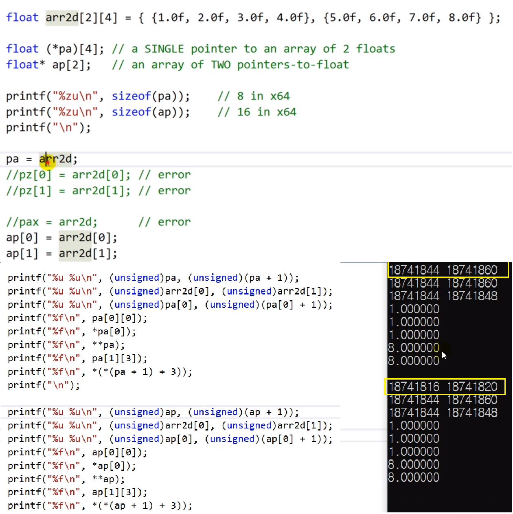

# 10.14 2차원 배열과 포인터

- 데이터를 훑는 순서: 오른쪽 인덱스부터 변하는 순서.
  - 1차원적 변화: ex) `[0][0]` => `[0][1]`: 메모리순서
  - 2차원적 변화: ex) `[0][0]` => `[1][0]`

# 2차원 배열에서의 배열 이름

- `arr = arr[0] == &arr[0] == &arr[0][0]` != `a[0][0]`
- **`&arr[0]`은 `arr[0]`를 저장하고 있는 주소가 아니다. 따로 저장되는 것은 아니다. 단지 계산을 해줄 뿐.**
- 2차원 배열과 그냥 숫자를 더하면 (ex: `arr + 1`), 행이 올라감. (결과는 주소)
- 다중포인터처럼 사용 가능.

## 예제

            int main(void)
            {
                float arr2d[2][4] = { {1.0f, 2.0f, 3.0f, 4.0f}, {5.0f, 6.0f, 7.0f, 8.0f} };

                printf("%u\n", (unsigned)arr2d);
                printf("%u\n", (unsigned)arr2d[0]);
                printf("\n");

                // arr2d points to arr2d[0] (not arr2d[0][0]),
                // arr2d[0]는 arr2d[0][0]의 주소. 그러나 값은 아님.

                printf("%u\n", (unsigned)*arr2d);
                printf("%u\n", (unsigned)& arr2d[0]);
                printf("%u\n", (unsigned)& arr2d[0][0]);
                printf("%f %f\n", arr2d[0][0], **arr2d);
                printf("\n");

                printf("%u\n", (unsigned)(arr2d + 1));
                printf("%u\n", (unsigned)(&arr2d[1]));
                printf("%u\n", (unsigned)(arr2d[1]));
                printf("%u\n", (unsigned)(*(arr2d + 1)));
                printf("%u\n", (unsigned)(&arr2d[0] + 1));
                printf("%u\n", (unsigned)(&arr2d[1][0]));
                printf("\n");

                printf("%f\n", *(*(arr2d + 1) + 2));
                printf("\n");

                for (int j = 0; j < 2; ++j)
                {
                    printf("[%d] = %u, %u\n", j, (unsigned)(arr2d[j]), (unsigned)*(arr2d + j));

                    for (int i = 0; i < 4; ++i)
                    {
                        printf("[%d][%d] = %f, %f\n", j, i, arr2d[j][i], *(*(arr2d + j) + i));

                        *(*(arr2d + j) + i) += 1.0f; // arr2d[j][i] += 1.0f;
                    }
                }
                printf("\n");
                return 0;
            }

- 16바이트 건너뜀
- 서로 같은 것 무엇인지 확인
- double indirection

## 다차원 배열에 대한 문법

- 출력결과: 다름
  - 이유: 포인터에 대한 배열이 새로 생긴 것이기 때문에 다르다.