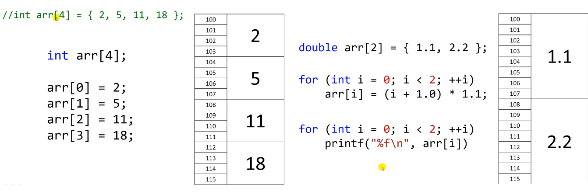
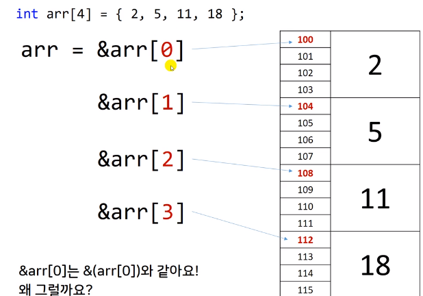

# 10.1 배열과 메모리

- 동일한 자료형을 가진 데이터를 대용량으로 사용할 때 배열을 사용한다.
- 배열과 메모리의 관계

* 유사한 것들이 쭉 나열되어 있는 것을 array라 함.

## 사용

- 예컨대 배열 없이 1~12월의 최저, 최고 기온을 저장해야 한다면?

  - ex) int jan_low = 1; .. .. ..

- 배열이라면?

  - int high[12] = {1, 2, 3, 4, ...}

- 배열을 사용하면 for문도 사용할 수 있음.

## 메모리

- array를 선언하면, 연속된 메모리 공간을 받는다는 특징이 있음.
- 초기화는 여러 방법.

## 포인터와 배열

- index가 0 => 첫 번째 주소
  - 1? => 자료형의 size만큼 한 칸 씩 건너간다.
  - 작동 방식은 `arr[0]`의 `&`를 찾아가는 원리.
    - 연산자 우선 순위가 `[]`이 `&`보다 높음.
  - 첨자(index)의 의미: arr로부터의 거리.
