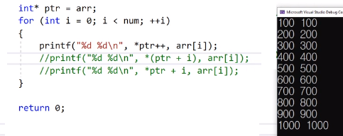
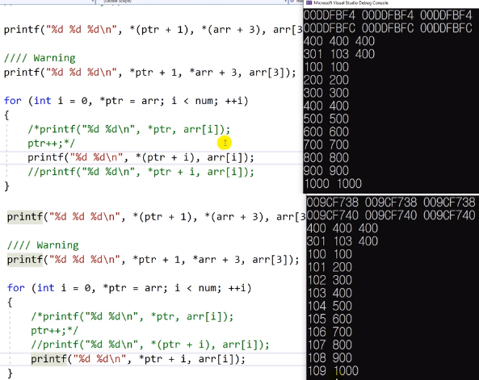

# 10.4 포인터와 배열

- 동적할당 때도 중요

## 예제

            int main(void)
            {
                int arr[10];

                int num = sizeof(arr) / sizeof(arr[0]);
                for (int i = 0; i < num; ++i)
                    arr[i] = (i + 1) * 100;

                int* ptr = arr;

                // int* ptr = NULL;
                // ptr = arr;

                printf("%p %p %p\n", ptr, arr, &arr[0]); // ① 모두 같은 값

                ptr += 2; ①

                printf("%p %p %p\n", ptr, arr + 2, &arr[2]); // ① 모두 같은 값

                // arr += 2; // invaild ②

                printf("%d %d %d\n", *(ptr + 1), *(arr + 3), arr[3]); // ① 모두 같은 값:

                printf("%d %d %d \n", *ptr + 1, *arr + 3, arr[3]);
                // ③ 주의

                return 0;
            }

- ① 배열의 이름은 포인터처럼 사용가능.
  - 포인터 산술연산을 서로 바꿔가며 사용할 수 있다.
- ② 직접 포인터 산술 연산은 안 됨.
  - `arr += 2`가 되면, arr의 시작주소도 바뀐다는 뜻.
  - 메모리 저장하는 것이 불가
- ③ dereference가 이루어진 후에 산술 연산이 되기에 다른 값이 나옴. 주의
  - `*(ptr + 1)` != `*ptr + 1`

* 반복문

- scope를 이용하여 이름이 겹치는 오류를 피할 수도 있음.

