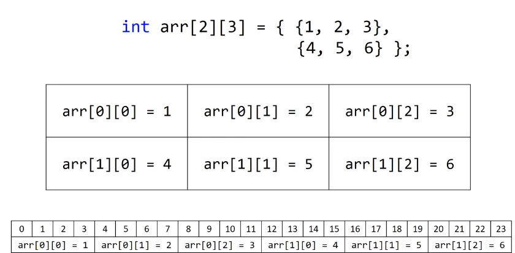
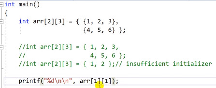
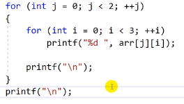
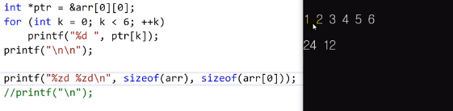

# 10.5 2차원 배열과 메모리

- 2차원 배열도 메모리는 1차원

- `arr[2][3]`: 3개 짜리가 2개 있다.
- 메모리는 여전히 1차원 공간이나, 프로그래머가 2차원처럼 쓸 수 있도록 컴파일러가 도와주는 것.

- 초기화는 1차원처럼도 가능, 빈 값 역시 0으로 초기화되는 것 동일.

* for 문

- i와 j의 배치.
- cf) 원소를 읽어오는 순서와 저장되어 있는 순서가 같으면 더 빠르게 읽음.

- `sizeof(arr)`은 배열 전체의 size, `sizeof(arr[0])`은 `[0][0] ~ [0][2]`를 나타낸 것. (arr은 2행 3열)
