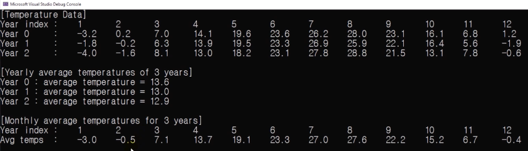

# 10.6 2차원 배열 연습문제

## MINE

            #include <stdio.h>

            #define MONTHS 12
            #define YEARS 3

            int main(void)
            {
                double year2016[MONTHS] = {-3.2, 0.2, 7.0, 14.1, 19.6, 23.6, 26.2, 28.0, 23.1, 16.1, 6.8, 1.2};
                double year2017[MONTHS] = {-1.8, -0.2, 6.3, 13.9, 19.5, 23.3, 26.9, 25.9, 22.1, 16.4, 5.6, -1.9};
                double year2018[MONTHS] = {-4.0, -1.6, 8.1, 13.0, 18.2, 23.1, 27.8, 28.8, 21.5, 13.1, 7.8, -0.6,};

                // temperature data
                
                double temps[YEARS][MONTHS] = {
                    {-3.2, 0.2, 7.0, 14.1, 19.6, 23.6, 26.2, 28.0, 23.1, 16.1, 6.8, 1.2},
                    {-1.8, -0.2, 6.3, 13.9, 19.5, 23.3, 26.9, 25.9, 22.1, 16.4, 5.6, -1.9},
                    {-4.0, -1.6, 8.1, 13.0, 18.2, 23.1, 27.8, 28.8, 21.5, 13.1, 7.8, -0.6,}
                };
                
                printf("[Temperature Data]\n");
                printf("Year index\t:\t");
                
                for (int i = 0; i < MONTHS; ++i)
                    printf("\t\t%d  ", i+1);
                printf("\n");
                
                for (int i = 0; i < YEARS; ++i)
                {
                    printf("year %d:         ",i);
                    for (int j = 0; j < MONTHS; ++j)
                    {
                        printf("\t%.1lf ",temps[i][j]);
                    }
                    printf("\n");
                }
                
                printf("[Yearly average temperatures of 3 years]");

                // yearly average temperatures of 3 years
                
                for (int i = 0; i < YEARS; ++i)
                {
                    double average = 0.0;
                    
                    for(int j = 0; j < MONTHS; ++j)
                        average += temps[i][j];
                    average /= (double)MONTHS;
                    
                    printf("\naverage: %.1lf", average);
                }
                printf("\n");
                printf("\n");
                
                // Monthly average temperatures for 3 years

                printf("[Monthly average temperatures for 3 years]\n");
                
                printf("Year index :\t");
                for (int i = 0; i < MONTHS; i++)
                    printf("%d\t", i+1);
                printf("\n");
                
                printf("Avg temps  :\t");
                for (int i = 0; i < MONTHS; i++)
                {
                    double yearAvg = 0.0;
                    for (int j = 0; j < YEARS; ++j)
                        yearAvg += temps[j][i];
                    yearAvg = yearAvg / 3;
                    printf("%.1lf\t",yearAvg);
                }
                
                printf("\n");
                return 0;
            }

