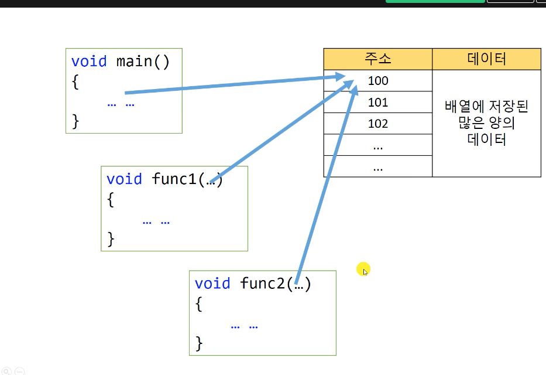

# 10.7 배열을 함수에게 전달해주는 방법

* 데이터를 여러 함수에서 쓴다고 가정해보자
    - 데이터를 전부 복사해서 함수로 보낸다면 시간도 많이 걸리고 메모리도 많이 써야 할 것이다.
    - 그러나 데이터의 맨 처음 주소만 알려주는 것으로도 사용이 가능하다면, 여러 곳에서 쓰기도 용이하고 메모리 사용면에서도 경제적이다.
    - 또한 배열을 함수마다 하나 씩 쓰는 것은 다양한 환경에 적응하기 어렵다.

* 배열의 이름은 포인터와 유사하다.
    - 포인터처럼 처리됨. 사실 함수 매개변수로 들어간 배열의 인덱스값은 의미가 없다.

* 함수에서 배열은 포인터로 받는다.
    - 또한, C에선 미리 용량이 정해지는 배열보단, 동적할당 등의 방법이 자주 쓰임.
    - 첫 주소와 인덱스 수는 따로 받아줘야 함.
    - cf) c++에선 배열과 인덱스 수를 한번에 보낼 수도 있음.

## 예제: 다양한 배열에 대처하기

            #include <stdio.h>

            #define MONTHS 12
            #define YEARS 3

            double average(double *arr, int n);

            int main(void)
            {
                double arr1[5] = {10, 13, 12, 7, 8};
                double arr2[3] = {1.8, -0.2, 6.3};
                
                printf("Address = %p\n", arr1);
                printf("Address = %zd\n", sizeof(arr1));
                printf("Address = %p\n", arr2);
                printf("Address = %zd\n", sizeof(arr2));

                printf("Avg = %f\n", average(arr1, 5));
                printf("Avg = %f\n", average(arr2, 3));
                
                return 0;
            }

            double average(double *arr, int n)
            {
                printf("Size = %zd in function average\n", sizeof(arr));
                
                double avg = 0.0;
                for (int i = 0; i < n; ++i)
                {
                    avg += arr[i];
                }
                avg /= (double)n;
                
                return avg;
            }

* 보통 배열 넘길 때도 __포인터__ 로 넘김. (`double average(double *arr, int n)`)
    - `n`은 보통 배열 값.