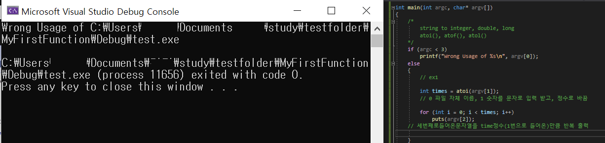
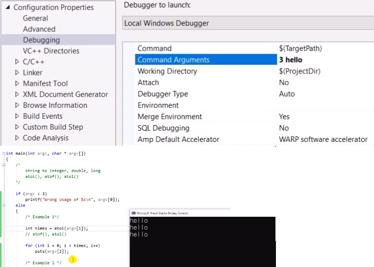
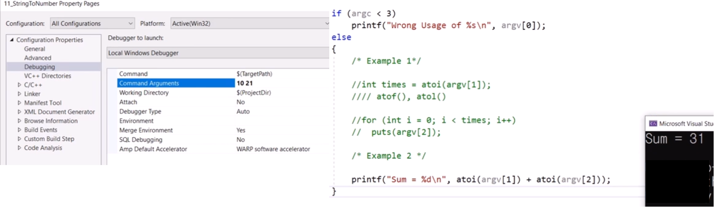
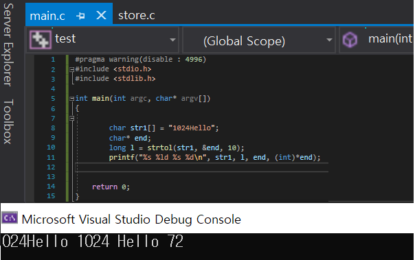
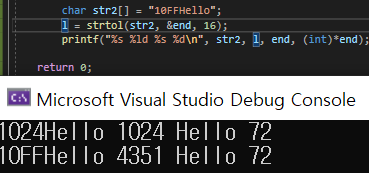
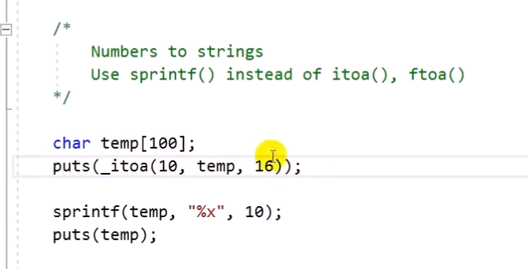

# 11.11 문자열을 숫자로 바꾸는 방법들

## 문자열을 숫자로 바꾸는 함수

### 예제 1

* 명령줄 인수가 없이 실행됨
    - 인수: 1개 => 실행파일은 꼭 들어감.

### 예제 2

* commandline arguments를 이용하여 print

### 예제 3
* 덧셈

* `.exe`파일을 직접 실행시킬 일이 있나? 
    - c, c++로 만든 파일을 스크립팅 언어로 반복해서 사용할 때가 있음.
    - ex) 파이썬 등, 유용.

### 예제 4: strtol(), strtoul(), strtod()
* `atoi`는 10진수만 가능.
* 10진수 이외 8, 16도 사용할 수 있는 함수
* `strtol()`: 문자열을 long으로 바꿈
* `strtoul()`: 문자열을 unsigned long으로 바꿈
* `strtod()`: 문자열을 double로 바꿈
    - `strtod()`는 10진수만 가능

#### 설명
- 변환을 원하는 문자열
    - 문자 그대로를 숫자로 바꿈.
    - Hello는 바꿀 수 없음
- `str` 함수의 특징은, `end`가 있다는 것.
    - `&end`: 이중 포인터

#### strtol()
- 변환을 하려던 문자 그대로 출력.
- 변환 결과: 1024 출력
- end는 포인터 => string처럼 출력됨.
- 변환이 안 되는 것은 end에 넣은 것.
- 음수도 가능

#### strtoul

* 16진수는 일부 문자가 그대로 변환되는 것처럼 보이기도 한다.
    - `10FF`는 16진수

#### Number to strings: sprintf() // instead of itoa(), ftoa()

* `_itoa`: 10진수를 16진수로 바꿔서 문자열로 바꾸고 있음.
    - 표준이 아니라 권하지 않음.
    - 오히려 `sprintf()`를 많이 사용
        - 문자열에 저장
        - 10을 16진수로 출력