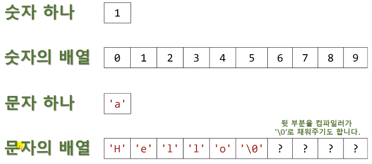
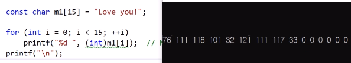
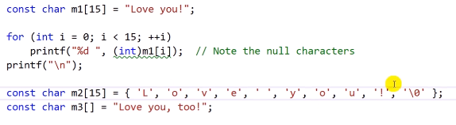
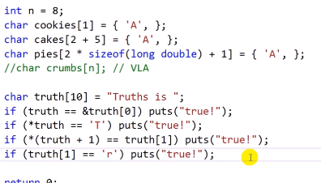

# 11.1 문자열을 정의하는 방법들

## 문자열을 초기화하는 방법

- `puts()` 함수: 문자열 출력.
  - 문자열의 포인터를 하나 받아들임.
  - 문자열이 배열의 일종처럼 메모리에 배치가 되어 있다면, 함수에 전달할 땐 첫 번째 주소를 포인터로 넘겨줄 수 있다.
  - 상수로 바로 집어넣기.
- 배열로 넣기 `char words[MAXLENGTH] = "A string in an array"'`
  - `char`타입의 배열
  - 넣으려는 단어 수가 몇인지 정확하게 알기 어렵기 때문에 넉넉한 사이즈 선언하는 편. (`#define MAXLENGTH 81`)
- Symbolic constant로 만들기. `#define MESSAGE "A symbolic string constant"`
  - `puts(MESSAGE)`
  - `puts()` 함수는 맨 뒤에 알아서 `\n`를 넣어준다.
- 포인터로 선언 (`const char* pt1 = "A pointer to a string.";`)
  - 문자열에 대한 포인터를 출력하는 것 가능. `puts(pt1)`
  - 포인터는 첫 주소만 가져온 것.

## warning or error

- **warning or error** 예시 (1)
  - `puts(words)`: 초기화되지 않은 변수를 쓴다는 메시지가 뜸.
  - 배열 내 문장이 들어가있지만, 모든 공간을 초기화하진 않았기 때문임.
  - 81개 선언되어 있지만 20여개에만 데이터가 들어 있기 때문.
- **warning or error** 예시 (2)
  - `words[3] = 'p';`는 ok
    - 배열 특정 원소에 접근해서 값을 바꿀 수 있음.
  - `pt1[8] = 'A';`는 런타임 error.
    - 건드리면 안 되는 곳을 건드림. (읽기 전용 메모리에 저장된 데이터의 값을 바꾸려고 시도하면 운영체제가 중단시킨다.)
    - `char* ptr1`을 `const char* ptr1`으로 하는 것이 바람직.

## 기타 성질

- `printf("%s, %p, %c\n", "we", "are", *"excellent programmers");`
  - `we, 메모리 주소, e` 출력.
  - 따로 변수로 받은 것은 아니나, `""`로 묶여 문자열로 취급됨.
  - `*`를 붙인다면.
    - 문자열은 배열과 비슷한 성질.
    - 문자열의 주소는, 문자열이 저장된 메모리에서 첫 번째 공간의 주소.
    - 그거에 대해 indirection하면 (`%c`로 찍히는 값), `e`

- 15개 중 사용자가 초기화하지 않은 부분은 **null character** 로 알아서 초기화됨.

- 초기화 하는 방법은 여러 가지.
  - 만약 하나 씩 할 경우, 맨 뒤에 `'\0'`을 넣어주어야 함.

* 일반적인 배열을 초기화하듯 `const char m3[] = "Love you, too!";`도 가능.

## 배열과 유사한 점

- 인덱스 부분에 변수 넣어도 되나, 실수는 안 됨.
- 배열처럼 여러 가지 사용가능.
