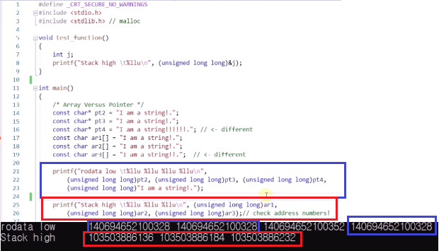

# 11.2 메모리 레이아웃과 문자열

- `char arr[] = "Hello, World";`
  - 배열: 그 자체로 메모리를 지님.
  - "Hello, World"라는 문자열의 내용물이 배열로 복사해 들어가면서 초기화됨.
- `char* str = "Hello, World";`
  - 포인터기 때문에 문자열의 첫 주소를 가리키기만 함.
  - `str[0] = 'M';`은 run-time 에러.

- 환경 변수: 환경에 대한 설정과 관련. (OS와 관련되는 내용, 프로그래밍이 실행되는 환경에 대한 변수)
- 스택 Stack: 지역변수들이 담기는 곳. 컴파일러가 변수의 용량을 예측할 수 있을 땐 stack 메모리를 씀. 새로 운영체제에서 받아올 때 속도 빠름. 크기를 컴파일러가 미리 예측. 메모리를 새로 운영체제에서 받아올 때 조금 빠름. 미리 크기를 알 수 있는 변수, 데이터기 때문에 컴파일러가 작동을 빨리 하도록 준비할 수 있음.
- 자유 공간: stack을 많이 사용해야 하는 경우엔 줄고, ~~.
- 힙 Heap: 컴파일러가 미리 용량을 알 수 없을 때 사용하는 곳.
- 초기화되지 않은 전역/정적 변수들 BSS(Block Started by Symbol) Segment
- 초기화된 전역/정적 변수들 DATA Segment
- 프로그램 코드 Text Segment

### 상세히

- 프로그램 코드: 프로그램이 올라오는 곳
  - 작성하고 컴파일해서 실행파일 만들어 둔 프로그램은 크기가 변하지 않음.
  - 프로그램 코드가 메모리에 올라와 있다.
    - 운영체제가 메모리의 값을 마음대로 바꾸기 어려움. 실행 중간에 갑자기 변할 수 없다.
    - 프로그램이 실행 도중 바뀌게 되면 오류가 나기 쉬움. 따라서 운영체제는 프로그램을 읽기 전용으로 막아둔다.
- 초기화된 전역/정적 변수들 DATA Segment
  - 변수들이 어떻게 초기화가 될지 미리 알고 있음.
  - 프로그램이 시작되면서 바로 초기화시킬 수 있음.
- 초기화되지 않은 전역/정적 변수는 0으로 초기화.

- 배열로 선언 => 한 글자 글자가 `arr`가 대표하는 메모리 공간으로 들어감. 메모리 공간을 갖고 있으니 값들을 변경할 수 있음.
- 포인터: 읽기 전용 메모리에 있기 때문에 쓰지 못함. (`str[0] = 'M';`은 run-time 에러.)

## 예제 1 Array vs Pointer

- rodata low(read only data)와 stack high 자리수가 다름.
- 경향성에 따라 다름. (windows, linux)
- rodata low
  - pt2, pt3에 저장되어 있는 주소값들은 동일, pt4가 가리키는 주소값은 다름.
  - `I am a string!`을 직접 입력해도 동일.
  - 완전히 동일한 문자로 이루어진 문자열 => 한 곳에 저장.
- stack high: 당연히 모두 다름.

## 예제 2 Local variable in a function

- 메모리 종류마다 주소가 서로 비슷함.
- 용도에 따라서 레이아웃에 맞춰 사용함.

## 문법

- pt2가 `I am a string`이었으나 ++로 하나가 날아감.
- `putchar()`: ascii 코드를 넣으면 출력해주는 함수.
- `head`는 포인터.
  - 포인터에 배열 이름을 넣을 수는 있지만 반대는 안 됨. (`heart = head`는 에러)
- 포인터: text segment에 있는 데이터를 가리킴

- 포인터를 통해선 원소 바꿀 수 없음. stack 메모리 가리키지 않음.
  - text segment: 이미 프로그램에 들어있는 파일.
  - 바꿀 수 없게 운영체제가 막음.
  - 런타임 에러
  - 컴파일은 되나 에러.
- 대표하는 포인터로 문장을 정의할 땐 `const`를 이용하는 것을 권장.

- 다른 공간, 다른 영역에 저장되는 것.
  - `str1` 포인터 변수 자체는 stack에 저장.
  - 문자열 데이터("When..")는 text segment에 저장.
    - `str1`와 `copy`는 같게 나옴.
- 문자열 자체를 복사하고 싶다면 `strcpy(), strncpy()` 등 사용 가능.
