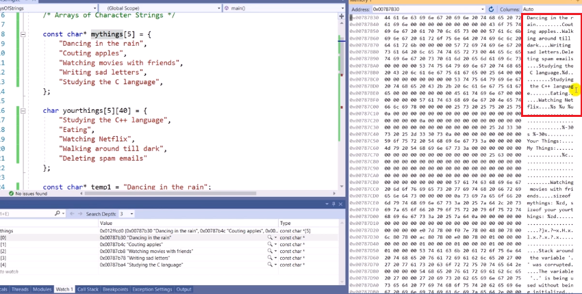
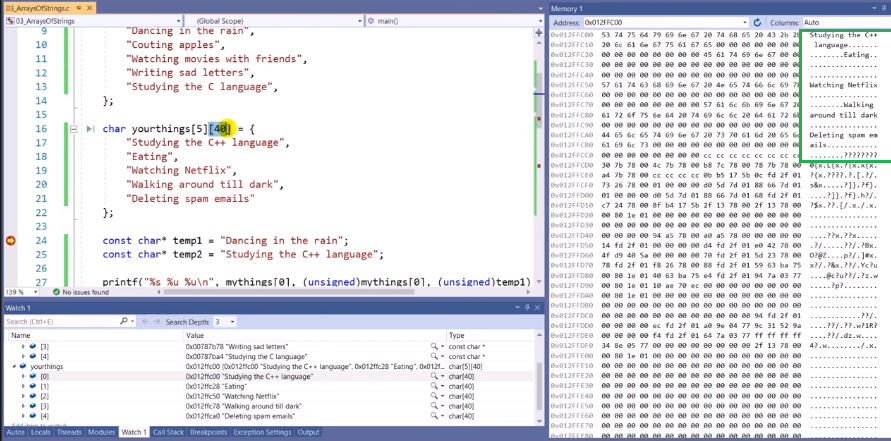
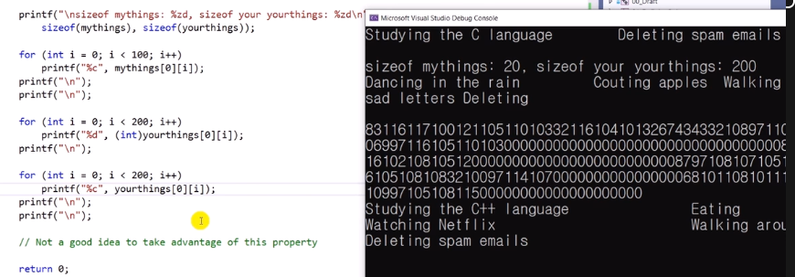

# 11.3 문자열의 배열

## 예제 1: 선언 방법

            const char* mythings[5] = {
                "Dancing in the rain",
                "Couting apples",
                "Watching movies with freinds",
                "Writting sad letters",
                "Studying the C language",
            };

            char yourthings[5][40] = {
                "Studying the c++ language",
                "Eating",
                "Watching Netflix",
                "Walking around till dark",
                "Deleting spam emails"
            };

            const char* temp1 = "Dancing in the rain";
            const char* temp2 = "Studying the C++ language";

- `const char* mythings[5]`: `char`타입에 대한 포인터가 5개 있는 배열
  - `sizeof(mythings)`: 20
    - 포인터 (4) * 5 = 20
- `char yourthings[5][40]`: 아예 크기가 정해져 있는 40개 짜리 배열을 5개 만듦.
  - `sizeof(yourthings)`: 200
    - 배열 => char(1) * 5 * 40 = 200

## 메모리 주소 살펴보기

      printf("%s %u %u\n", mythings[0], (unsigned)mythings[0], (unsigned)temp1);
      printf("%s %u %u\n", yourthings[0], (unsigned)yourthings[0], (unsigned)temp2);

- 같은 이유: 포인팅만 하고 있기 때문에, 둘다 text segment에 두어서 같은 주소.
- 다른 이유: 스택에 메모리로 갖고 있음. 별도의 메모리로 존재.

## 디버거로 찍어보기

- 1번

* 프로그램의 일부가 들어와 있는, 저장되어 있는 공간이라 다 보임.

- 2번

* `yourthings`로 간 결과.

  - `......` 컴파일러가 넣어주는 0, 40바이트 중 남는 공간, 빈칸

* 1, 2 사진을 보면, 1번에만 있는 데이터가 있고, 1번과 2번 두 곳에서 다 찾을 수 있는 데이터가 있다. 왜 그런가?
  - `yourthings`: 프로그램의 일부로서 저장이 되어 있다가, 사본이 `yourthings`에 복사해서 들어가는 것이기 때문에 2 copies로 존재한다.
  - `mythings`: 메모리에 하나로만 존재한다.

* 포인터로 저장하는 것과 배열로 저장하는 것이 어떤 차이가 있는지 알 수 있다.
  - 포인터: 하나의 값으로만 저장하기 때문에 메모리를 절약할 수 있음. but Read only, 값을 바꿀 순 없음.

## 예제 2

  

- 문장, 빈칸
  - 배열을 출력한다는 측면에선 문제가 많음. (더 많은 인덱스를 넣기 때문에)
- ASCII 코드 출력, 0000, ....
  - Char로 출력하면 아래 문장.
- 메모리에 있는 것들을 출력하는 작업이라 이해할 순 있음. but 권장하진 않음.
