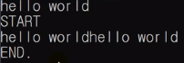
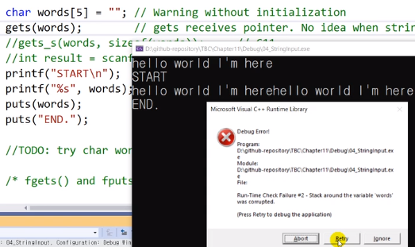
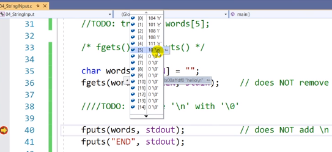
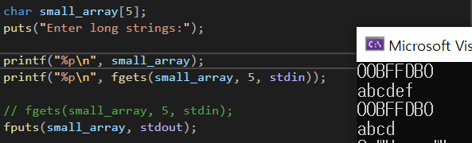
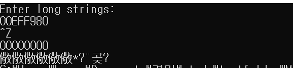
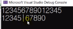

# 11.4 문자열을 입력받는 다양한 방법들

- 주의할 점: 저장할 메모리 공간을 확보하고 입력 받아야 함.

## scanf

            #define STRLEN 81

            // char* name = ""; // runtime
            char name[128];
            int result = scanf("%s", name);

- 메모리 공간을 확보해야 함. (`char name[128]`)
- `scanf()` vs `gets()`
  - `scanf()`: 한 단어만 읽어 들임.
  - `gets()` : 한 줄을 통째로 읽을 수 있음. 줄 입력 시, enter를 입력받는 순간, 마지막에 있던 줄바꿈 문자를 삭제하고 null character를 입력시킴.

## gets와 puts

            char words[STRLEN] = "";
            gets(words);

            printf("START\n");
            printf("%s", words);
            puts(words);
            puts("END. ");

- 원형: `char _ gets (char _ str);`
  - 배열을 대표하는 주소를 집어 넣어라.
- 최근엔 `gets_s`
- `puts`: 줄바꿈을 알아서 넣어준다.

* `printf`는 줄바꿈x, `puts`는 줄바꿈 o
  - 배열의 이름 - 포인터
  - `gets(words)`: gets 함수 입장에선, 포인터를 하나 받으니 시작지점은 알지만 메모리의 끝 지점을 모름.
* `gets_s(words, sizeof(words))`: C11에서 추가
  - 사이즈까지 입력.
  - 컴파일러에 따라 지원 여부 갈림.

### 런타임 에러

 

- 배열의 크기를 충분히 설정해주지 않아(`char words[5]`) 런타임 에러 발생.

## fgets와 fputs

            char words[STRLEN] = "";
            fgets(words, STRLEN, stdin);

- fgets: 원래 파일 입력하는 함수.
- string을 받을 때 `fgets`러 빋을 수 있는데, 이땐 뒤에 `stdin`을 추가.
  - `fgets(word, STRLEN, stdin);`
  - 읽어들이는 data가 언제 끝날지 모르는 걸 알고 받아들임.
  - `gets`보다 `fgets`가 더 안정적.
  - **주의: `\n`을 삭제해주지 않음.**
    - 파일에 사용할 땐 좋음. (곧이 곧대로 받기 때문에.)

## fgets fputs실습

- `[5]`에 있는 `'\n'`를 '\0'으로 바꾸기

### mine

            char words[STRLEN] = "";
            fgets(words, STRLEN, stdin);

            int brPoint = 0;

            int i = 0;
            while ( brPoint!= 1) {
                if (words[i] == '\n') {
                    words[i] = '\0';
                    brPoint = 1;
                    }
                i++;
            }

            fputs(words, stdout);
            fputs("END", stdout);

### prof

            char words[STRLEN] = "";
            fgets(words, STRLEN, stdin);

            int i = 0;
            while (words[i] != '\n' && words[i] != '\0')
                i++;
            if (words[i] == '\n')
                words[i] = '\0';

            fputs(words, stdout);
            fputs("END", stdout);

- `\n` => `\0`으로 바뀌어져 있음.

### fputs

            fputs(words, stdout);
            fputs("END", stdout);

- 파일에 출력할 때 사용하는 함수. (`stdout`) 이용하여 콘솔창으로 출력하도록 함. (표준 입출력)
- 파일을 출력할 땐 군더더기가 없어야 하므로, 뒤에 `\n`을 추가하지 않음.

## 저장할 공간이 작을 경우

            char small_array[5];
            puts("Enter long strings:");
            fgets(small_array, 5, stdin);
            fputs(small_array, stdout);

- 5칸 => 마지막 `null charater`까지 포함.
  - 4글자만 입력 받음.
- run-time error가 나지 않음. (편리한 점)
- `fgets`는 리턴 값이 있음. (정상적으로 입력 받으면) (주소)
  - `EOF`를 만나면 `null character`를 리턴.

- 정상 작동: `small_array`의 주소가 출력 (동일)
- 정상적으로 입력한 문자는 `null character` 포함 5개까지 들어감.

- `ctrl+z`을 이용 인위적으로 EOF 입력
  - null 반환

### Repeating short reading

            char small_array[5];
            puts("Enter long strings : ");
            while (fgets(small_array, 5, stdin) != NULL && small_array[0] != '\n')
                fputs(small_array, stdout);

- 작은 버퍼를 여러 번 반복 재활용하며 큰 내용을 받아들이기.
- 반복해서 받아들이고 반복해서 출력. 한번에 하는 것처럼 보임

### scanf()

            char str1[6], str2[6];
            int count = scanf("%5s %5s", str1, str2);

            printf("%s|%s \n", str1, str2);

- `scanf()` 내부에서 `%s` 앞에 `5`를 붙여줌으로 5글자 씩 받도록 설정.
- 동일하게 `scanf_s`도 이용가능. (`int count = scanf("%5s %5s", str1, 6, str2, 6`)

### 입력 받는 함수를 만들어 쓰기 Prof

            char word[11];
            puts(custom_string_input(word, 11));

            char* custom_string_input(char* st, int n)
            {
                char* ret_ptr;
                int i = 0;

                ret_ptr = fgets(st, n, stdin);
                if (ret_ptr)
                {
                    while (st[i] != '\n' && st[i] != '\0')
                        i++;
                    if (st[i] == '\n')
                        st[i] = '\0';
                    else
                        while (getchar() != '\n')
                            continue;

                }
                return ret_ptr;
            }
