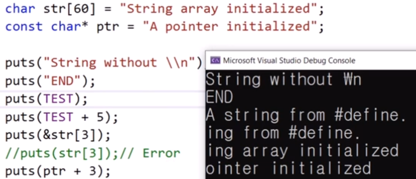
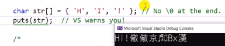
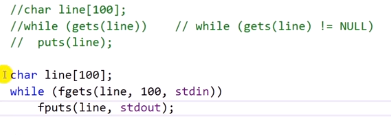
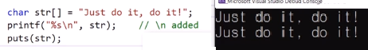
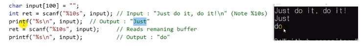

# 11.5 문자열을 출력하는 다양한 방법들

## 예제

`#define TEST "A string from #define"`

- `+ 5`, `ptr + 3`: 문자열의 시작 포인터가 바뀐 것처럼 실행됨

## null character가 없도록 초기화하기

- null character를 만나야 끝나는데, null character가 없음
  - 메모리에 존재하는 null character를 우연히 만나야 끝나는 것으로 알려져 있음.
- 문자열을 초기화할 땐 꼭 null character가 뒤에 있어야 함.

## puts() and fputs()

- 최대 몇 글자를 입력 받거나 출력할지 설정.
  - 미리 저장 공간의 수를 알아서 입력하기
  - puts는 개수가 필요하진 않음.

## printf()

- newline을 인위적으로 추가해주어야 함.

## scanf()

- scanf 10글자 제한
  - 빈칸을 만나면 읽어들이지 않음. (한 단어)
- 여러 가지 자료형이 섞여있을 때 받기 편안함.

## 직접 puts같은 함수를 만들기

- `void custom_put(const char* str)`: newline 더하기 x, 포인터 증가연산, `putchar()` 이용하기
  - 함수의 몸체를 2줄로 만들기
- `int custom_put2(const char* str)`: 위 기능에 `\n`을 더하고, 글자수를 반환하는 기능 추가

### 실습 mine

- `void custom_put(const char* str)`

            void custom_put(const char* str)
            {
                for (int i = 0; *(str + i) != '\0'; i++)
                    putchar(*(str + i));
            }

* `int custom_put2(const char* str)`

            int custom_put2(const char* str)
            {
                int count = 0;
                for (int i = 0; *(str + i) != '\0'; i++)
                {
                    putchar(*(str + i));
                    count++;
                    if (*(str + i) == '\0')
                        putchar('\n');
                }
                return count;
            }

## prof.

- `void custom_put(const char* str)`

            void custom_put(const char* str)
            {
                while (*str != '\0') // while(*str)
                    putchar(*str++);
            }

- `int custom_put2(const char* str)`

            int custom_put2(const char* str)
            {
                int count = 0;
                while (*str)
                {
                    putchar(*str++);
                    count++;
                }
                putchar('\n');

                return count;
            }
