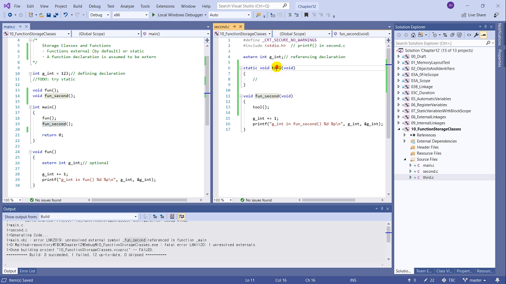

# 12.11 함수의 저장 공간 분류

* 함수는 external이 기본, static도 가능.
    - 함수는 프로그램과 함께 로딩, 메모리에 계속 있음.
    - 선언(declaration)은 extern을 가정. 

## 예시

* 사실은 함수 앞에 `extern`이 생략되어 있는 것.

## static 사용하기
* second.c: `extern void fun_second(void)` => 링킹 에러
    - 파일 내에서만 사용할 수 있다고 막아버림.
    - `static`은 변수와 유사하게 작동
* static의 필요성?
    - 파일을 나눌 땐 모듈(기능) 기준으로 정리함.
    - 모듈 밖에서는 사용하지 않도록 하고 싶다면?

* prototype에서만 static을 붙여도, body에 붙인 것과 동일한 효과.