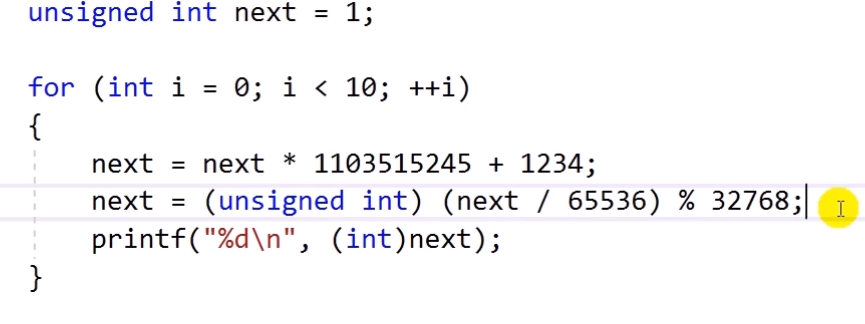
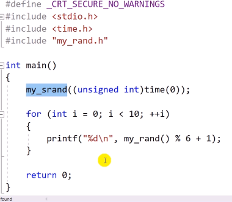

# 12.12 난수 생성기 모듈 만들기 예제

## 난수 생성
* 난수를 생성할 때: `rand()` 함수를 사용.
    - 0 to RAND_MAX (typically INT_MAX)의 숫자를 random하게 만들어 줌.
    - `stdlib.h`
    - 실행시킬 때마다 같은 수가 출력됨.
    - seed 값에 따라 값이 달라짐. 
        - 동일한 seed 값엔 같은 결과.
        - 이에 `time` 함수 사용.

## 난수 알고리즘

## 문제

* rand()와 동일한 것을 만들기.

* `main.c`

            #pragma warning(disable : 4996)
            #include <stdio.h>
            #include <time.h>
            #include "my_rand.h"

            int main()
            {
                my_srand((unsigned int)time(0));

                for (int i = 0; i < 10; ++i)
                {
                    printf("%d\n", my_rand() % 6 + 1);
                }
                    return 0;
            }

* `my_rand.c`

            static unsigned int next = 1;

            int my_rand()
            {
                next = next * 1103515245 + 1234;
                next = (unsigned int)(next / 65536) % 32768;
                printf("%d\n", (int)next);

                return (int)next;
            }

            void my_srand(unsigned int seed)
            {
                next = seed;
            }

* `my_rand.h`

            #pragma once

            int my_rand();
            void my_srand(unsigned int seed);

* `#pragma once`: `#pragma once`가 선언된 파일을 한 번만 로딩하라는 뜻.
    - "전처리기야, `my_rand.h`는 프로그램을 실행하면서 한 번만 로딩하렴."