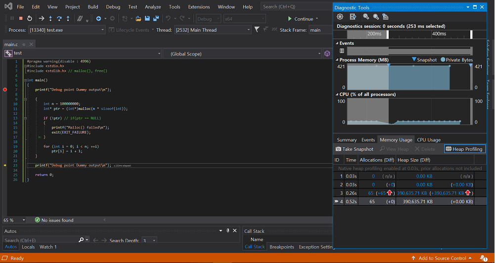
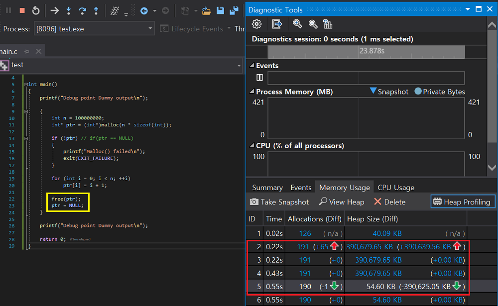
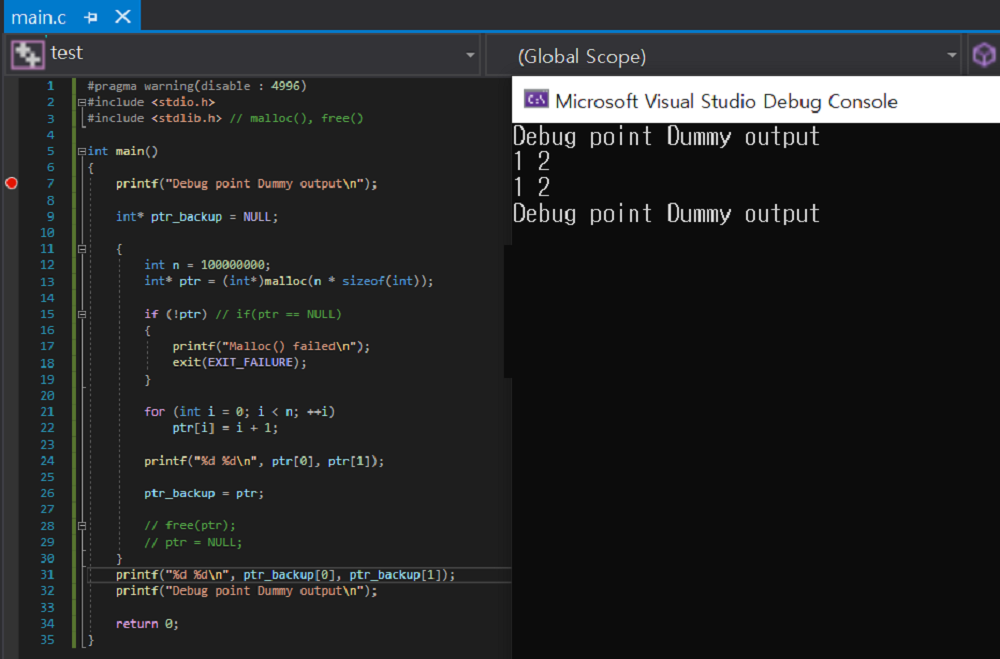
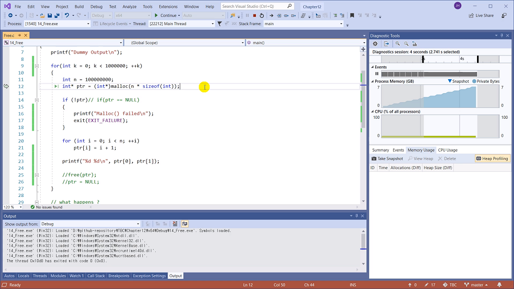
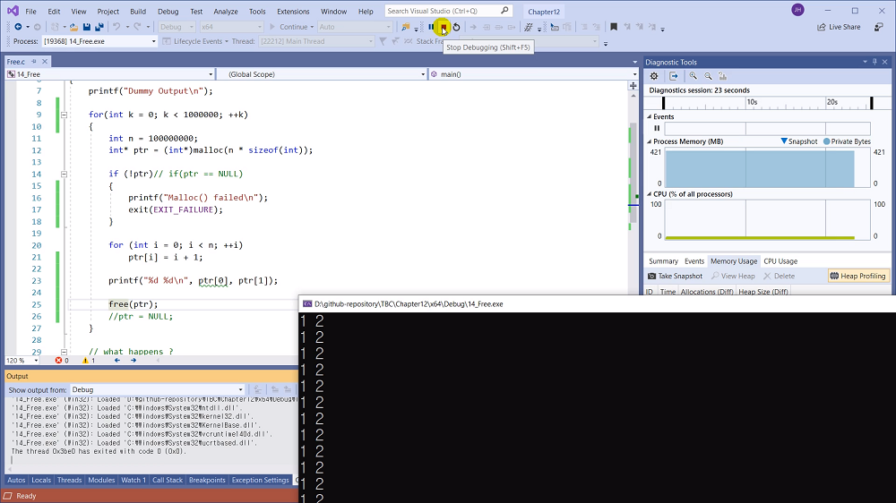
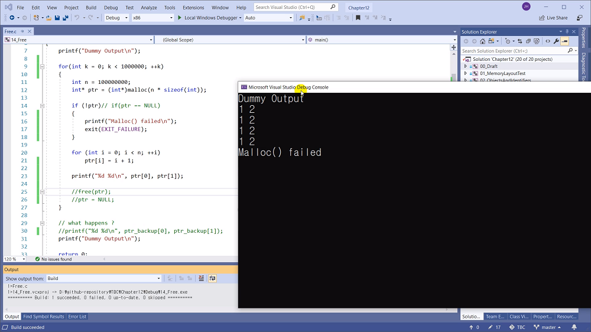

# 12.14 메모리 누수 Leak와 free()의 중요성
### 비주얼 스튜디오 진단 도구 Diagnostic Tool 사용

## 메모리 누수
* 반납하지 않았을 때 일어나는 일

## 실습
* show diagnostic tools 이용

* 다량의 메모리를 불러와 사용했지만, ptr은 block scope라 이후 자동으로 사라졌음.
* 그러나 불러왔던 메모리는 heap 영역의 것으로, 가리킬 수는 없지만 사라지지 않았음.
* 이에 23줄까지 가더라도 사용한 메모리는 400MB 이상 유지되는 것.

## free() 사용

## 생각해볼 점

* 스코프를 나와도 `free()`를 하지 않으면, 메모리엔 값들이 그대로 남아있다.
    - 접근하려면?
        - 물론 바람직하진 않음. 
    - 블록을 나오기 전에 포인터를 이용하여 backup하기.
    - free()를 하지 않음.
    - 주소는 블록을 나오면 사라지지만, 메모리는 유지되므로 이용할 수 있음.

## 메모리 누수
* 계속 할당만 받는다면?

## free 사용

* x86일 땐 메모리 용량이 낮기 떄문에 malloc failed가 뜰 수도 있다.
