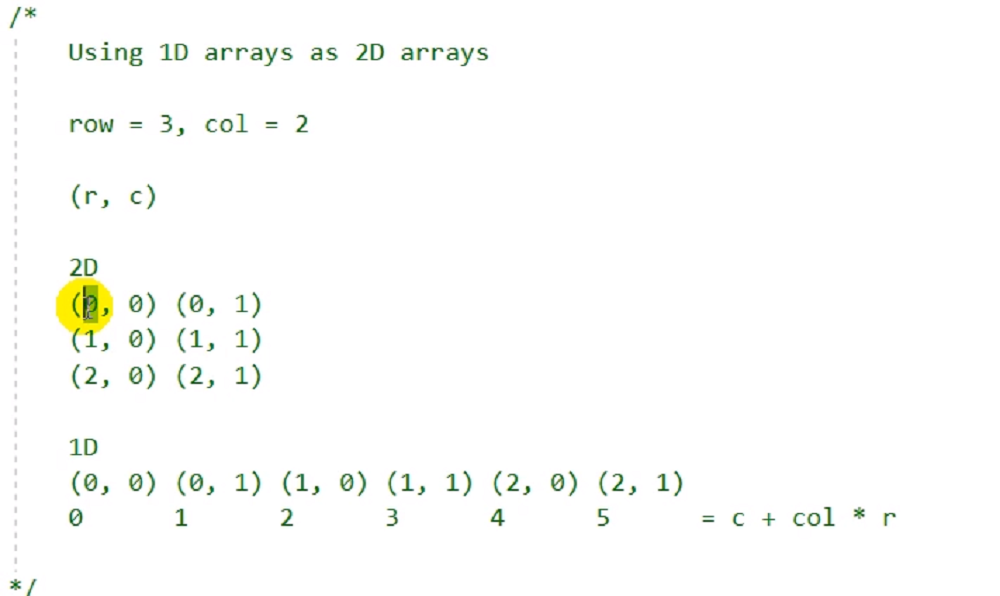
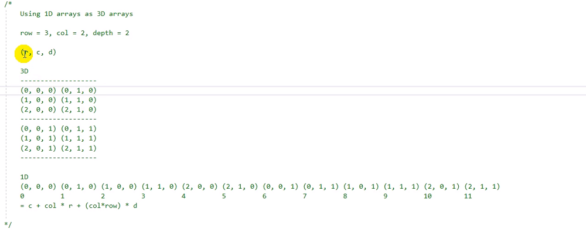
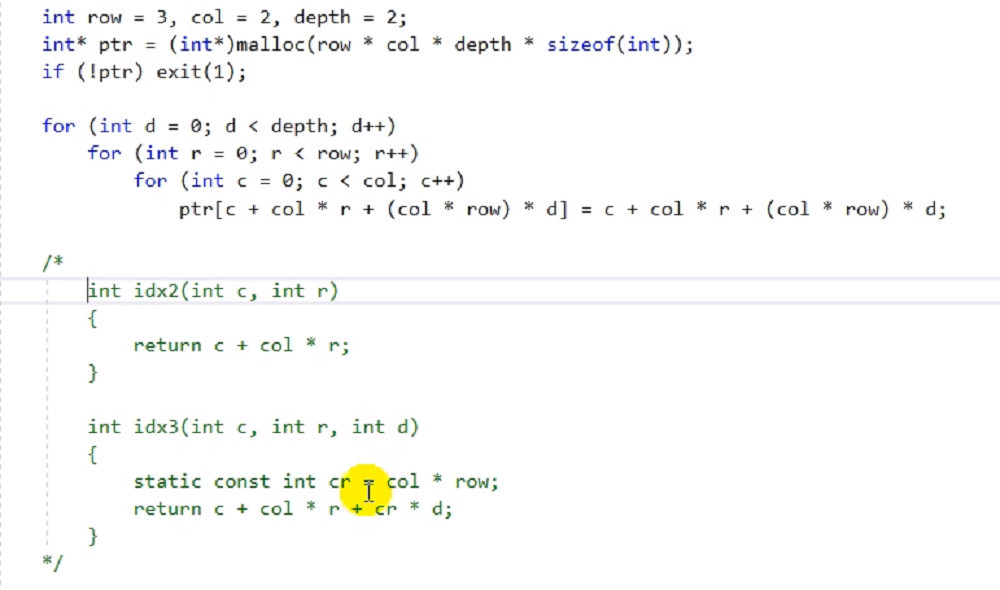
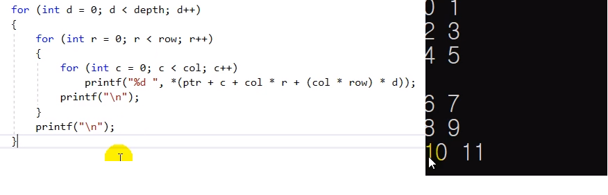

# 12.15 동적 할당 메모리를 배열처럼 사용하기
* 실제로 어떻게 사용하는가?

## 변수 하나에 대한 포인터처럼 사용하기

            int* ptr = NULL;
            
            ptr = (int*)malloc(sizeof(int) * 1);
            if (!ptr) exit(1);

            *ptr = 1024 * 3;
            printf("%d\n", *ptr);

            free(ptr);
            ptr = NULL;

* 그러나 이렇게 쓰는 경우는 거의 없음.

## 일차원 배열처럼 사용하기

            int main()
            {
                int n = 3;
                int* ptr = (int*)malloc(sizeof(int) * n);
                if (!ptr) exit(1);

                ptr[0] = 123;
                *(ptr + 1) = 456;
                *(ptr + 2) = 789;

                free(ptr);
                ptr = NULL;

                return 0;
            }

* 배열은 스택에서 알아서 빠지지만, 동적 할당은 수동으로 해제해주어야 함.
    - 많은 데이터를 쓸 땐 동적할당 메모리를 배열보다 많이 씀.
* 연산을 위해 포인터를 int로 casting하였음.

## 이차원 배열처럼 사용하기

### 예시
            int row = 3, col = 2;
            int(*ptr2d)[2] = (int(*)[2])malloc(sizeof(int) * row * col);
            // int(*ptr2d)[col] = (int(*)[col])malloc(sizeof(int) * row * col); VLA

            for (int r = 0; r < row; r++)
                for (int c = 0; c < col; c++)
                    ptr2d[r][c] = c + col * r;

            for (int r = 0; r < row; r++)
            {
                for (int c = 0; c < col; c++)
                    printf("%d ", p tr2d[r][c]);
                printf("\n")
            }

* 배열 index에 constant를 넣는다면 쓰는 장점이 떨어짐. (VLA는 GCC에서 가능)

### 실용적인 예시
* 컴퓨터의 메모리구조는 1차원. 단 2차원 배열처럼 사용할 순 있다.

            int row = 3, col = 2;
            int* ptr = (int*)malloc(row * col * sizeof(int));
            if (!ptr) exit(1);

            for (int r = 0; r < row; r++)
                for (int c = 0; c < col; c++)
                    ptr[c + col * r] = c + col * r;

            for (int r = 0; r < row; r++)
            {
                for (int c = 0; c < col; c++)
                    printf("%d ", *(ptr + c + col * r));
                printf("\n");
            }

## 삼차원 배열

* 이차원을 건너뛰는 방식

* 함수로 구현

* 출력

## 사차원 배열
* row, col, depth, h (예시)
* `index = c + col * r + (col * row) * d + (row * col * depth) * h`
* 일차원 배열을 위와 같은 인덱싱으로 사차원처럼 접근.