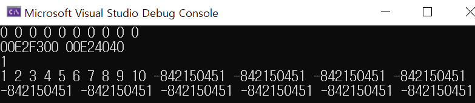

# 12.16 calloc(), realloc()
## calloc()

            #include <stdio.h>
            #include <stdlib.h> 

            int main()
            {
                int n = 10;

                int* ptr = NULL;

                // ptr = (int*)malloc(sizeof(int) * n);
                ptr = (int*)calloc(n, sizeof(int));
                if (!ptr)
                    exit(1);

                for (int i = 0; i < n; ++i)
                    printf("%d ", ptr[i]);
                printf("\n");

                return 0;
            }

* contiguous allocation: 연속해있는 메모리 공간 할당
* malloc()과의 일차적인 차이: parameter가 2개.
* malloc()은 메모리를 초기화해주지 않음.
    - calloc()은 메모리를 0으로 초기화해줌.

## realloc()

            for (int i = 0; i < n; ++i)
                    ptr[i] = i + 1;

            n = 20;

            int* ptr2 = NULL;
            ptr2 = (int*)realloc(ptr, n * sizeof(int));
            // ptr = (int*)realloc(ptr, n * sizeof(int));

            printf("%p %p\n", ptr, ptr2);

            printf("%d\n", ptr[0]);

            if (!ptr2)
                exit(1);
            else
                ptr = NULL; // 원래 포인터를 NULL

            for (int i = 0; i < n; ++i)
                printf("%d ", ptr2[i]); 
            printf("\n");

            free(ptr2);

* 동적할당으로 한번 받았는데, 필요로 하는 사이즈가 늘어나거나 줄었을 경우, 다시 할당받기 위해 사용하는 함수

* realloc()이 요청한 사이즈가 예전 사이즈보다 클 경우, 원래 있던 메모리의 데이터를 복사해준다.
    - 그러나 새롭게 할당해주는 메모리에 대해 초기화를 해주진 않음.

* argument는 2개
    - ptr: 이미 갖고 있는 메모리에 대한 포인터. (메모리 블럭에 대한 포인터)
    - 새롭게 받고 싶은 사이즈를 우측에 기록.
    - n이 20으로 바뀜 
    - second argument가 0이라면, free

* ptr이 NULL 포인터라면, malloc처럼 사용됨.

## 전체

            #pragma warning(disable : 4996)
            #include <stdio.h>
            #include <stdlib.h> 

            int main()
            {
                int n = 10;

                int* ptr = NULL;

                // ptr = (int*)malloc(sizeof(int) * n);
                ptr = (int*)calloc(n, sizeof(int));
                if (!ptr)
                    exit(1);

                for (int i = 0; i < n; ++i)
                    printf("%d ", ptr[i]);
                printf("\n");

                for (int i = 0; i < n; ++i)
                    ptr[i] = i + 1;

                n = 20;

                int* ptr2 = NULL;
                ptr2 = (int*)realloc(ptr, n * sizeof(int));
                // ptr = (int*)realloc(ptr, n * sizeof(int));

                printf("%p %p\n", ptr, ptr2);

                printf("%d\n", ptr[0]);

                if (!ptr2)
                    exit(1);
                else
                    ptr = NULL; // 원래 포인터를 NULL

                for (int i = 0; i < n; ++i)
                    printf("%d ", ptr2[i]); 
                printf("\n");

                free(ptr2);

                return 0;
            }

## 실행결과

* calloc(), realloc()의 특징 살펴보기.
