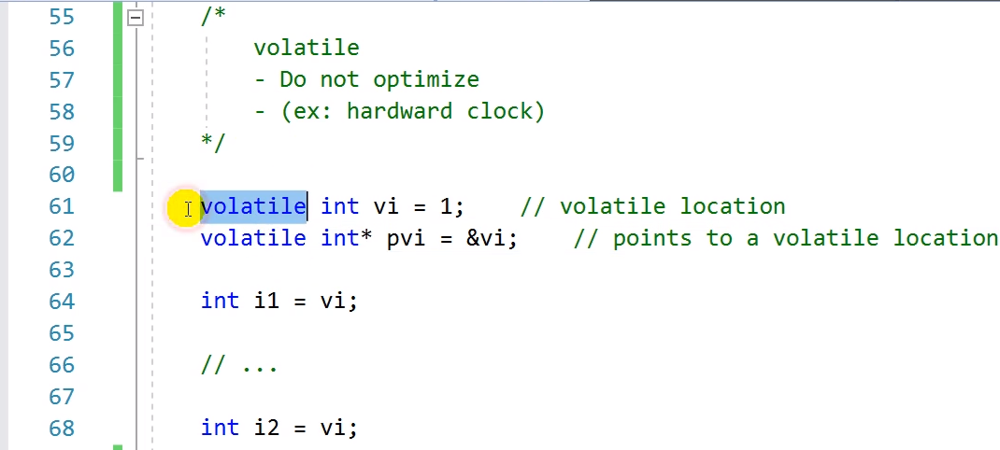
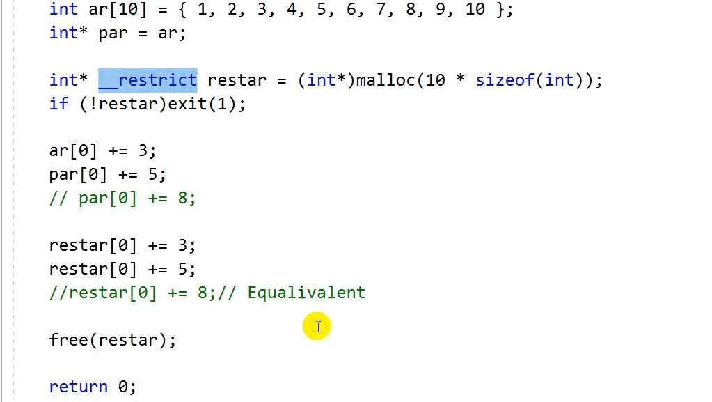

# 12.18 자료형 한정자들 Type Qualifiers: const, volatile, restrict

## const
* C99부터 한정자를 여러 개 써도 허용되기 시작. (C99 ideompotent)
    - `const const const int n = 6;` == `const int n = 6;`
    - `typedef const int zip;`
        - `const zip q = 8` == `const const int zip`
        - typedef를 통해 자료형을 만들었는데, 여기에 const를 다시 붙이면 문제가 발생하곤 했음. 이런 문제를 방지하고자 허용.

* 초기화를 해주어야 함

            const int i;
            i = 12; // Error
            printf("%d\n", i); // Error

* 포인터와 const
    - const의 위치 1

            const float* pf1 = &f1;
            //*pf1 = 5.0f; // Error
            pf1 = &f2; // Allowed

    - const의 위치 2

            float* const pf2 = &f1;

            *pf2 = 6.0f;
            //pf2 = &f2; // Error

    - const의 위치 3

            const float* const pf3 = &f1;
            //*pf3 = 7.0f; // Error
            // pf3 = &pf2; // Error

* Gloval constants
    - header 파일을 만들어 따로 모아두기

## volatile
* 의미: '휘발성'
    - 내가 작성한 프로그램 내 변수가, 컴파일러가 모르는 사이에 바뀔 수 있다는 의미.
    - 컴파일러야 최적화하지 마라.
    - 캐슁을 하지 못하게 함.

## restrict
* data object에게 접근하는 게 이거 하나 뿐이다.
* 포인터로 값을 바꾸는 것과 배열로 값을 바꾸는 것은 같음.
    - 컴파일러는 최적화하고 싶을 수도 있음.
    - 하지만 다른 이름이기에 하지 못함
* 그러나 동적할당 받은 메모리의 경우, restrict라는 키워드를 이용해주면, 두 개의 연산을 1개로 생각하는 것도 가능하다. (최적화 도울 수 있다.)
    - restrict 선언된 것으로만 접근하겠다는 의미.
    - 동적할당 받은 것의 포인터가 하나밖에 없는지 컴파일러는 알 수 없음.

