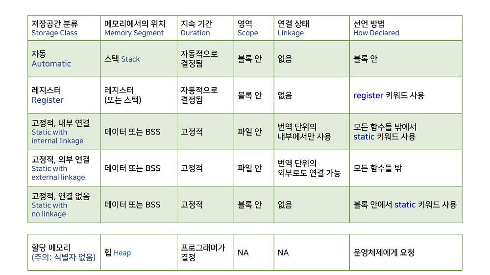

# 12.7 블록 영역의 정적 Static 변수

* static: 처음부터 끝까지 자리를 잡고 있다.
    - 그렇다면 코드 상 어디서나 읽어올 수 있을까?
    - 이것이 되는 것은 전역변수
* 블록 영역의 정적 변수: 블록 내에서만 static 변수이므로 일반적인 경우와 다르다.
    - linkage가 없다.
    - 포인터 등으로 간접적으로 사용할 순 있다.
    - 굳이 블록 밖에서 사용할 필요는 없음. (그냥 gloval variable을 사용)

## 실습

            #include <stdio.h>

            void count()
            {
                int ct = 0;
                printf("count = %d %lld\n", ct, (long long)&ct);
                ct++;
            }

            void static_count()
            {
                static int ct = 0; // initialized only once
                printf("static count = %d %lld\n", ct, (long long)&ct);
                ct++;
            }

            void counter_caller() 
            {
                count();
            }

            void static_counter_caller()
            {
                static_count();
            }

            int main()
            {
                count();
                count();
                counter_caller();

                static_count();
                static_count();
                static_counter_caller();

                return 0;

            }

* 일반적일 땐 메모리가 다르게 배정됨을 볼 수 있음.

### static 변수를 parameter로 사용하기: X

            int func(static int i)
            {

            }

* Visual Studio는 warning, 컴파일은 되지만, GCC에선 Error
* 함수가 실행될 땐 새로운 스택 프레임이 설정된다.
    - parameter는 사실상 함수가 실행될 때 메모리 구조를 받게 됨.
    - 그런데 static을 붙인다는 건, parameter를 static에 넣겠다는 이야기이니 이상함.

### pointer를 반환값으로 사용하기

            int* count()
            {
                int ct = 0;
                printf("count = %d %lld\n", ct, (long long)&ct);
                ct++;

                return &ct;
            }

            int* static_count()
            {
                static int ct = 0; // initialized only once
                printf("static count = %d %lld\n", ct, (long long)&ct);
                ct++;

                return &ct;
            }

* 받는다: 메모리에서 반환하여 사용하고 싶다는 뜻.
    - 그러나 `int* count()`의 경우 반환하는 주소의 변수는 사라질 변수임.
    - `int* static_count()`의 경우는 권장하진 않으나 사용할 수는.. 있음. 
        - 바람직한 예시는 아님. 그렇게까지 사용하고 싶다면 차라리 전역변수를 쓰는 것이 낫다.   
