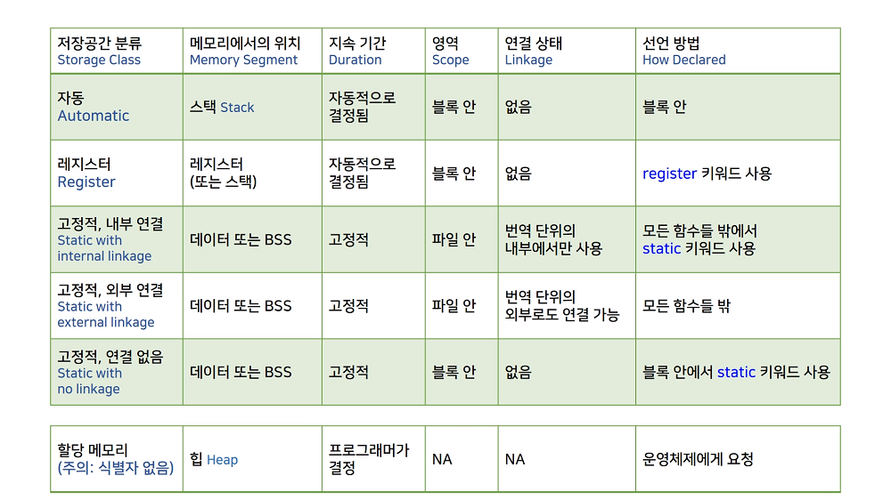
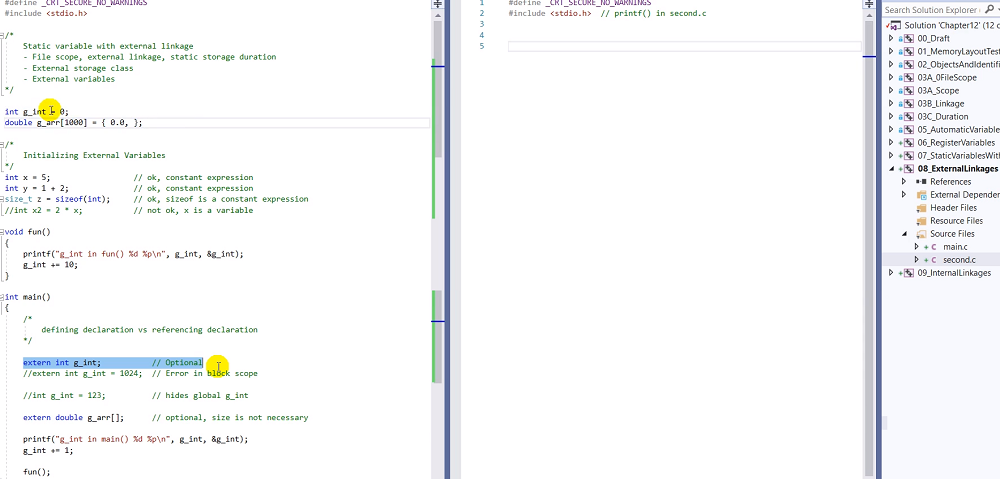
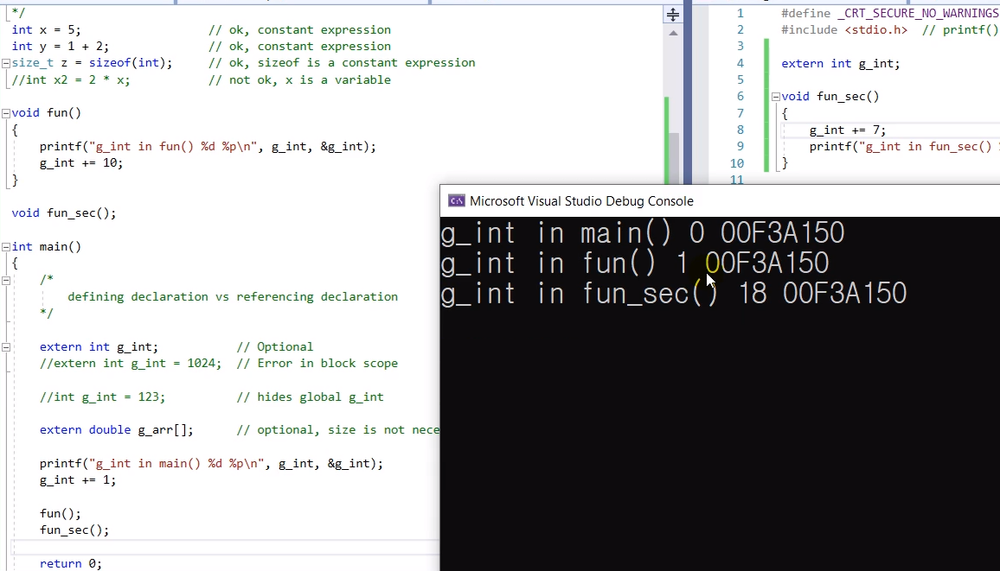
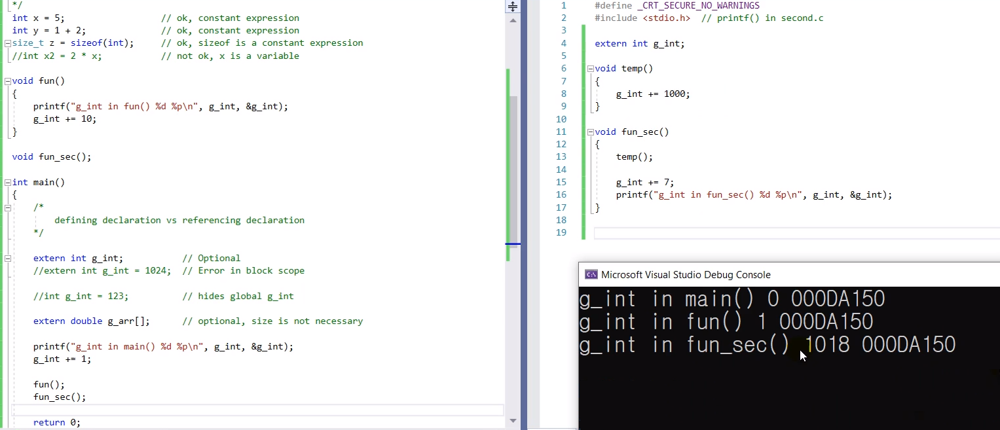

# 12.8 정적 변수의 외부 연결

* 번역 단위 (translation unit)
    - 컴파일: `.c` 파일 단위.
    - 외부 연결: 파일 밖에서도 사용 가능함.
    - 파일 간의 연결: 링킹
        - 실행파일 생성

## 실습

* 같은 이름의 지역 변수를 사용하면 그 스코프 내에선 최근 선언된 변수를 사용.
    - 이런 것을 방지하는 방법: `int g_int` => `extern int g_int`
    - 그 이후 선언: redefinition
    - 명확히 표시해두는 것이 좋음.
    - 변수 선언 시 접두사로 표시하기도 함. (`int g_int`): global

## external

* `fun_sec()`를 main에서 부르기: 선언만 하면 됨.
* `main.c`에 정의되어 있는 변수 쓰기
    - `extern int g_int`

* block scope에서 extern을 초기화할 수 없음.
    - file scope에서 초기화 가능.
    - 링킹 에러: 여러.c 파일에서 같은 extern 변수를 초기화.

* extern이 붙은 곳에서 초기화하는 것은 헷갈린다.

