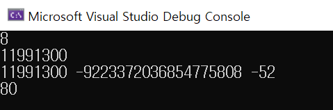
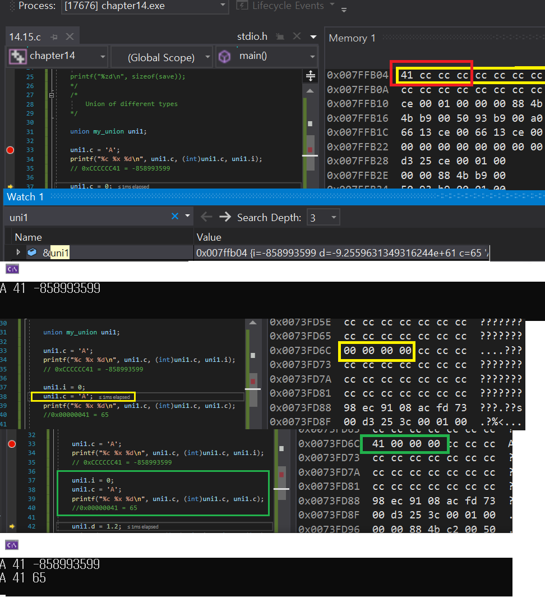
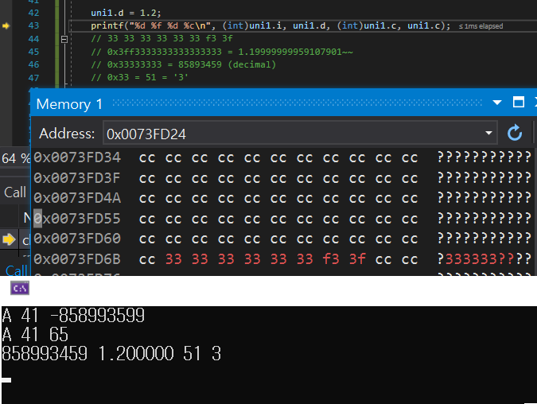

# 14.15 공용체의 원리

* 서로 데이터 타입이 다른 데이터들이 같은 메모리 공간을 사용하도록 해주는 것.

## 원리 1

            union my_union {
                int		i;
                double	d;
                char	c;
            };

            union my_union uni;

            printf("%zd\n", sizeof(union my_union));
            printf("%lld\n", (long long)&uni);
            printf("%lld %lld %lld\n", (long long)&uni.i, (long long)uni.d, (long long)uni.c);

            union my_union save[10];

            printf("%zd\n", sizeof(save));

* 공용체: 메모리를 공유하기 때문. 가장 큰 자료형의 사이즈 배정
    - double => 8, 적어도 8바이트가 필요하므로
* 주소
    - 공용체의 주소, 첫 번째 멤버의 주소 ~ 세 번째 멤버의 주소 모두 동일.
    - 메모리를 공유하기 때문
* 배열: 당연히 8 * 10 = 80

## 원리 2

            union my_union uni1;

            uni1.c = 'A';
            printf("%c %x %d\n", uni1.c, (int)uni1.c, uni1.i); // A 41 -858993599
            
            uni1.i = 0;
            uni1.c = 'A';
            printf("%c %x %d\n", uni1.c, (int)uni1.c, uni1.c);
            //0x00000041 = 65\

* 공유하고 있기 때문에 첫 번째에만 41 들어감.
    - 총 8바이트를 사용 중
    - int는 4바이트, 이것을 16진수로 표현 => `41 cc cc cc`을 16진수로 표현 => `0xCCCCCC41`
    - 0xCCCCCC41를 10진수로 변환하면, `-858993599`
    - [참고 링크](http://www.binaryconvert.com/result_signed_int.html?hexadecimal=CCCCCC41)

* i는 4바이트, 37줄을 지나면 0으로 초기화됨을 확인 가능
* `uni1.c = 'A'`가 되며 주소 내 `'A'` 저장. (41)
* 이를 각각 캐릭터, 16진수, 10진수로 출력하면 A 41 65

## 원리 3

            uni1.d = 1.2;
            printf("%d %f %d %c\n", (int)uni1.i, uni1.d, (int)uni1.c, uni1.c); // 858993459 1.200000 51 3
            // 33 33 33 33 33 33 f3 3f
            // 0x3ff3333333333333333 = 1.19999999959107901~~
            // 0x33333333 = 85893459 (decimal)
            // 0x33 = 51 = '3'

* `uni1.d = 1.2` 에 따라 메모리에 값이 입력됨. (33 33 33..)
* 이를 출력ㅎ   
* 1바이트 부분만 char로 변환: 0x33
    - 10진수: 51 
    - ASCII에서 찾으면 문자 '3'
* 4바이트 부분만 읽으면 0x33333333 = 85893459

## 초기화
### 대입 연산자를 이용한 copy
            union my_union {
                int		i;
                double	d;
                char	c;
            };

            union my_union uni2 = uni1;		// copy another union
### 값을 넣어 초기화하는 것은 첫 번째 element를 대상으로만 가능

            union my_union uni3 = { 10 };	// First element (member) only

### Designated initializer

            union my_union uni4 = { .c = 'A' }; // Designated initializer
* 정확하게 사용

### Do not recommend

            union my_union uni5 = { .d = 1.23, .i = 100 }; // Do Not recommend
            printf("%d %f %c\n", uni5.i, uni5.d, uni5.c);

* 구조체처럼 designated initializer를 여러 개 쓸 수도 있지만, 공용체에선 초기화를 어디에 맞춰서 하고 싶은 것인지 불분명하므로 권장하지 않음.

    - 뒤의 값에 맞춰서 결과가 나온다.

            uni.i = 123;
            uni.d = 1.2;
            uni.c = 'k';

            printf("%d %f %c\n", uni.i, uni.d, uni.c); 
* 각각 값이 다르게 나옴
* k는 정확하게 나오지만 나머지는 정확도가 떨어짐.

### 포인터 활용

            union my_union* pu = &uni; // pointer to union
            int x = pu->i; // -> operator, same as x = fit.digit

* 구조체처럼 화살표 사용 가능 

### Do not recommend
            uni.c = 'A';
            double real = 3.14 * uni.d; // do NOT recommend

* 공용체가 유연하고 편리하나 실수 위험성 ↑
* c로 값을 넣어두고 d로 이용하는 건지.

