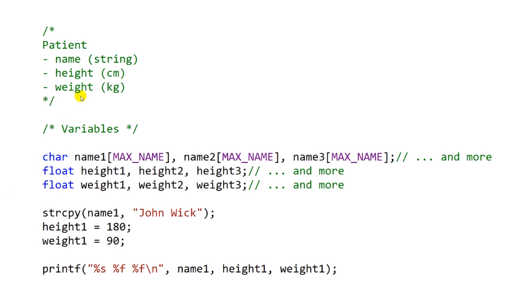
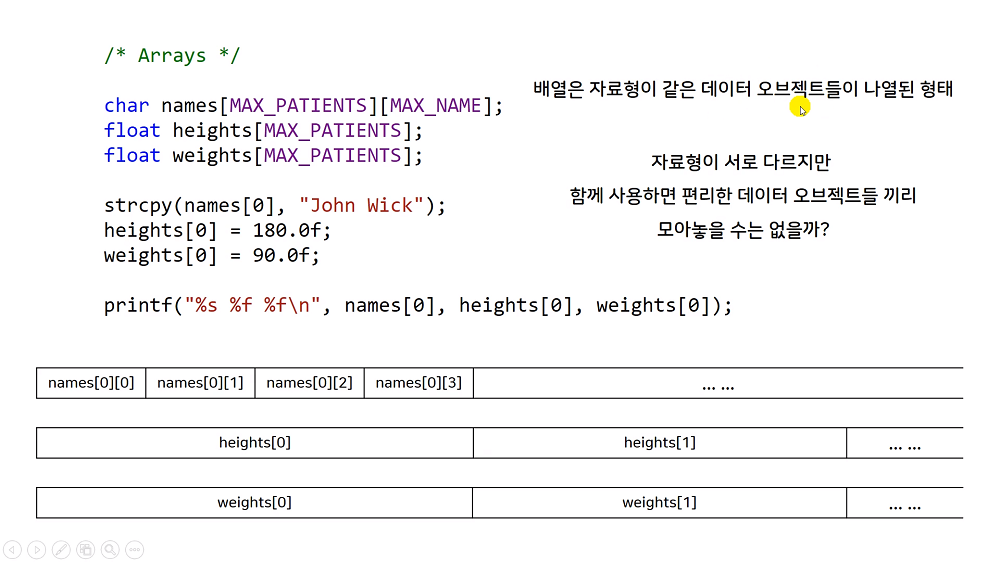
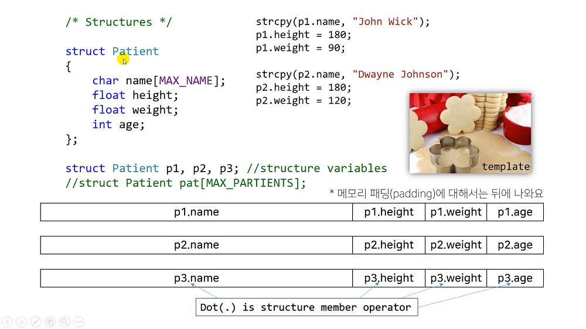

# 14.1 구조체가 필요한 이유
## Intro

* 변수를 이용한다면?
    - 환자가 1000명이면 그에 맞게 서로 다른 변수를 1000개 씩 만들어야 함.

* 배열을 이용한다면?
    - 이름 배열에서 하나 찾고, 키 배열에서 하나 찾고, 몸무게 배열에서 하나 찾는 등, 프로그래머 입장에서 발생하는 불편함이 있음.

## 구조체

* 서로 다른 자료형을 모아서 하나의 새로운 자료형처럼 다룰 수 있게 함.
* 새로운 자료형인 것처럼 변수로도 선언 가능. (structure variables 구조체 변수)
* `.`: structure member operator (구조체 멤버 연산자)
    - 각각의 멤버에 접근할 수 있도록 하는 연산자.
    - 붙어있지는 않음. 메모리 패딩

### 템플릿 Template
* 틀
* 구조가 짜여진 하나의 덩어리: 틀
* 변수로 선언할 때 메모리에 실제로 존재하게 됨.
    - 데이터 구조를 사용할 수 있는 data object들을 만들어 낸다.

* 참고: C++에선 따로 template 문법이 있음.
